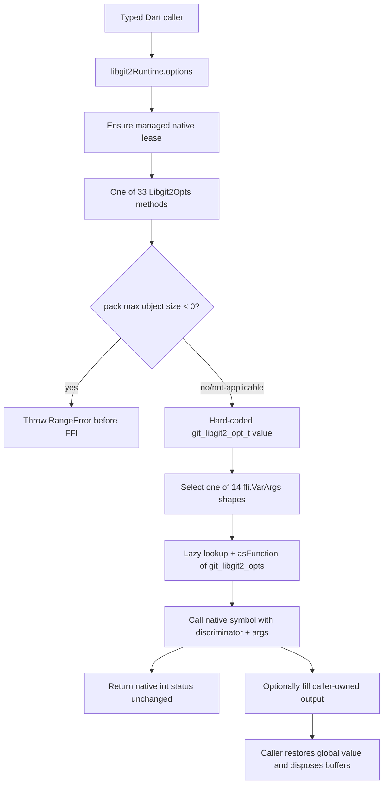

# libgit2 Global Options Flow

🟢 CONFIRMED: the source implements the dispatch and ownership boundary above. 🟢 Native evidence exists for selected shapes when a declared 64-bit payload loads. 🔴 GAP: no inspected hosted matrix proves all 33 discriminators on every supported platform.
