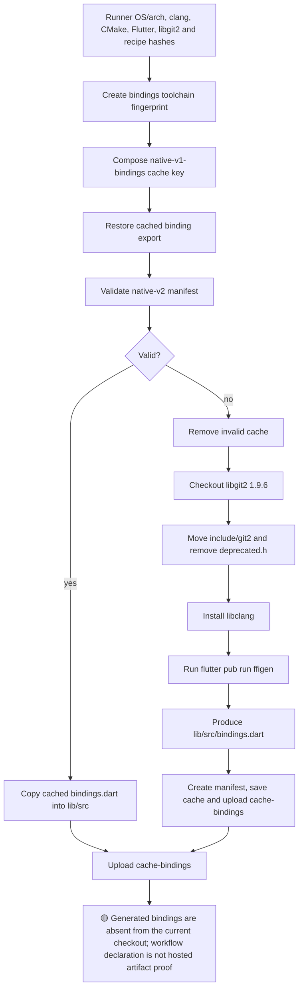

# Dart Bindings Generation State Machine

```mermaid
flowchart TD
  Inputs["Runner OS/arch, clang, CMake, Flutter, libgit2 and recipe hashes"] --> Fingerprint["Create bindings toolchain fingerprint"]
  Fingerprint --> Key["Compose native-v1-bindings cache key"]
  Key --> Restore["Restore cached binding export"]
  Restore --> Validate["Validate native-v2 manifest"]
  Validate --> Valid{"Valid?"}
  Valid -- yes --> Copy["Copy cached bindings.dart into lib/src"]
  Valid -- no --> Clean["Remove invalid cache"]
  Clean --> Checkout["Checkout libgit2 1.9.6"]
  Checkout --> Headers["Move include/git2 and remove deprecated.h"]
  Headers --> Libclang["Install libclang"]
  Libclang --> Ffigen["Run flutter pub run ffigen"]
  Ffigen --> Output["Produce lib/src/bindings.dart"]
  Output --> Manifest["Create manifest, save cache and upload cache-bindings"]
  Copy --> Artifact["Upload cache-bindings"]
  Manifest --> Artifact
  Artifact --> Gap["🟡 Generated bindings are absent from the current checkout; workflow declaration is not hosted artifact proof"]
```

