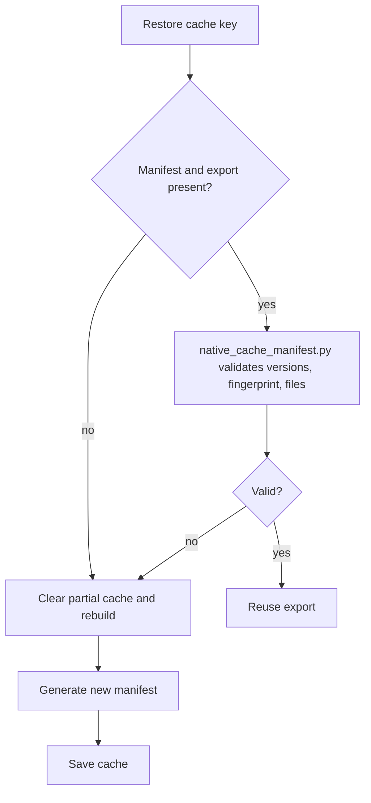

# Native Cache Validation Function

```mermaid
flowchart TD
  Restore["Restore cache key"] --> Present{"Manifest and export present?"}
  Present -- no --> Rebuild["Clear partial cache and rebuild"]
  Present -- yes --> Validate["native_cache_manifest.py validates versions, fingerprint, files"]
  Validate --> Good{"Valid?"}
  Good -- no --> Rebuild
  Good -- yes --> Reuse["Reuse export"]
  Rebuild --> Manifest["Generate new manifest"]
  Manifest --> Save["Save cache"]
```

