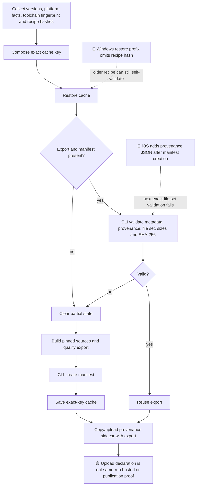

# Native Cache Validation Function

```mermaid
flowchart TD
  Facts["Collect versions, platform facts, toolchain fingerprint and recipe hashes"] --> Key["Compose exact cache key"]
  Key --> Restore["Restore cache"]
  Restore --> Present{"Export and manifest present?"}
  Present -- no --> Clear["Clear partial state"]
  Present -- yes --> Validate["CLI validate metadata, provenance, file set, sizes and SHA-256"]
  Validate --> Good{"Valid?"}
  Good -- yes --> Reuse["Reuse export"]
  Good -- no --> Clear
  Clear --> Build["Build pinned sources and qualify export"]
  Build --> Create["CLI create manifest"]
  Create --> Save["Save exact-key cache"]
  Save --> Sidecar["Copy/upload provenance sidecar with export"]
  Reuse --> Sidecar
  Windows["🔴 Windows restore prefix omits recipe hash"] -. "older recipe can still self-validate" .-> Restore
  IOS["🔴 iOS adds provenance JSON after manifest creation"] -. "next exact file-set validation fails" .-> Validate
  Sidecar --> Boundary["🟡 Upload declaration is not same-run hosted or publication proof"]
```
