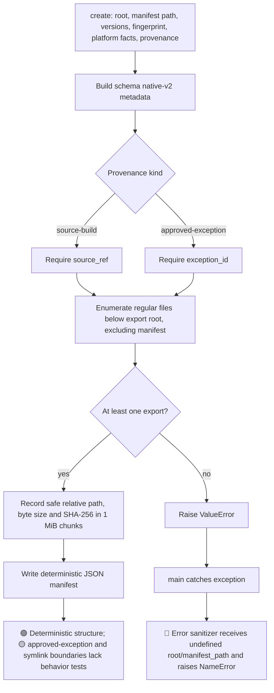

# Native Cache Manifest Creation

```mermaid
flowchart TD
  Args["create: root, manifest path, versions, fingerprint, platform facts, provenance"] --> Metadata["Build schema native-v2 metadata"]
  Metadata --> Provenance{"Provenance kind"}
  Provenance -- source-build --> SourceRef["Require source_ref"]
  Provenance -- approved-exception --> Exception["Require exception_id"]
  SourceRef --> Enumerate["Enumerate regular files below export root, excluding manifest"]
  Exception --> Enumerate
  Enumerate --> Nonempty{"At least one export?"}
  Nonempty -- yes --> Hash["Record safe relative path, byte size and SHA-256 in 1 MiB chunks"]
  Hash --> Write["Write deterministic JSON manifest"]
  Nonempty -- no --> ValueError["Raise ValueError"]
  ValueError --> MainCatch["main catches exception"]
  MainCatch --> NameError["🔴 Error sanitizer receives undefined root/manifest_path and raises NameError"]
  Write --> Boundary["🟢 Deterministic structure; 🟡 approved-exception and symlink boundaries lack behavior tests"]
```

