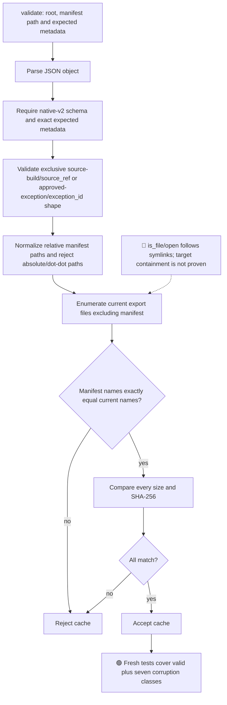

# Native Cache Manifest Validation

```mermaid
flowchart TD
  Args["validate: root, manifest path and expected metadata"] --> Parse["Parse JSON object"]
  Parse --> Schema["Require native-v2 schema and exact expected metadata"]
  Schema --> Provenance["Validate exclusive source-build/source_ref or approved-exception/exception_id shape"]
  Provenance --> Paths["Normalize relative manifest paths and reject absolute/dot-dot paths"]
  Paths --> Current["Enumerate current export files excluding manifest"]
  Current --> Exact{"Manifest names exactly equal current names?"}
  Exact -- no --> Reject["Reject cache"]
  Exact -- yes --> Detail["Compare every size and SHA-256"]
  Detail --> Match{"All match?"}
  Match -- no --> Reject
  Match -- yes --> Accept["Accept cache"]
  Symlink["🔴 is_file/open follows symlinks; target containment is not proven"] -.-> Current
  Accept --> Proof["🟢 Fresh tests cover valid plus seven corruption classes"]
```

