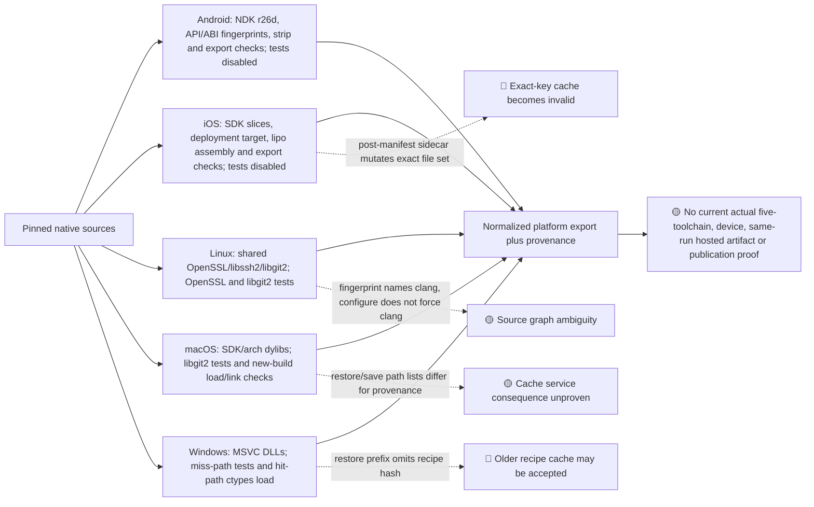

# Five-Platform Native Build Routes

```mermaid
flowchart LR
  Start["Pinned native sources"] --> Android["Android: NDK r26d, API/ABI fingerprints, strip and export checks; tests disabled"]
  Start --> IOS["iOS: SDK slices, deployment target, lipo assembly and export checks; tests disabled"]
  Start --> Linux["Linux: shared OpenSSL/libssh2/libgit2; OpenSSL and libgit2 tests"]
  Start --> Mac["macOS: SDK/arch dylibs; libgit2 tests and new-build load/link checks"]
  Start --> Windows["Windows: MSVC DLLs; miss-path tests and hit-path ctypes load"]
  Android --> Export["Normalized platform export plus provenance"]
  IOS --> Export
  Linux --> Export
  Mac --> Export
  Windows --> Export
  Linux -. "fingerprint names clang, configure does not force clang" .-> Gap["🟡 Source graph ambiguity"]
  IOS -. "post-manifest sidecar mutates exact file set" .-> Red["🔴 Exact-key cache becomes invalid"]
  Windows -. "restore prefix omits recipe hash" .-> Red2["🔴 Older recipe cache may be accepted"]
  Mac -. "restore/save path lists differ for provenance" .-> Gap2["🟡 Cache service consequence unproven"]
  Export --> Boundary["🟡 No current actual five-toolchain, device, same-run hosted artifact or publication proof"]
```

