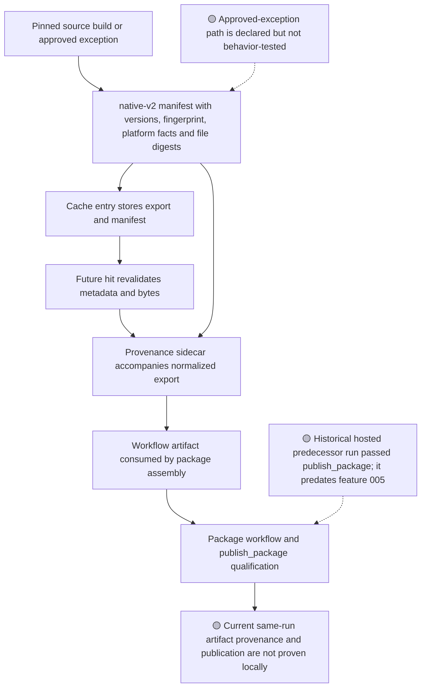

# Native Artifact Provenance Route

```mermaid
flowchart TD
  Build["Pinned source build or approved exception"] --> Manifest["native-v2 manifest with versions, fingerprint, platform facts and file digests"]
  Manifest --> Cache["Cache entry stores export and manifest"]
  Cache --> Hit["Future hit revalidates metadata and bytes"]
  Hit --> Sidecar["Provenance sidecar accompanies normalized export"]
  Manifest --> Sidecar
  Sidecar --> Artifact["Workflow artifact consumed by package assembly"]
  Artifact --> PublishGate["Package workflow and publish_package qualification"]
  Exception["🟡 Approved-exception path is declared but not behavior-tested"] -.-> Manifest
  Historical["🟡 Historical hosted predecessor run passed publish_package; it predates feature 005"] -.-> PublishGate
  PublishGate --> CurrentGap["🟡 Current same-run artifact provenance and publication are not proven locally"]
```

