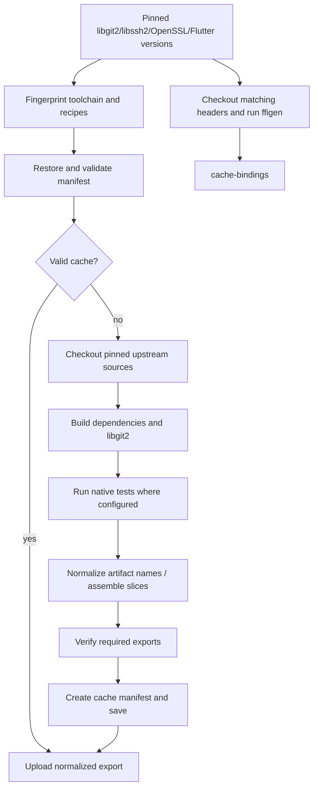

# Native Build and Bindings Generation Flow

```mermaid
flowchart TD
  Pins["Pinned libgit2/libssh2/OpenSSL/Flutter versions"] --> Fingerprint["Fingerprint toolchain and recipes"]
  Fingerprint --> Cache["Restore and validate manifest"]
  Cache --> Valid{"Valid cache?"}
  Valid -- yes --> Upload["Upload normalized export"]
  Valid -- no --> Source["Checkout pinned upstream sources"]
  Source --> Build["Build dependencies and libgit2"]
  Build --> Test["Run native tests where configured"]
  Test --> Normalize["Normalize artifact names / assemble slices"]
  Normalize --> Symbols["Verify required exports"]
  Symbols --> Manifest["Create cache manifest and save"]
  Manifest --> Upload
  Pins --> Bindings["Checkout matching headers and run ffigen"]
  Bindings --> BindingArtifact["cache-bindings"]
```

