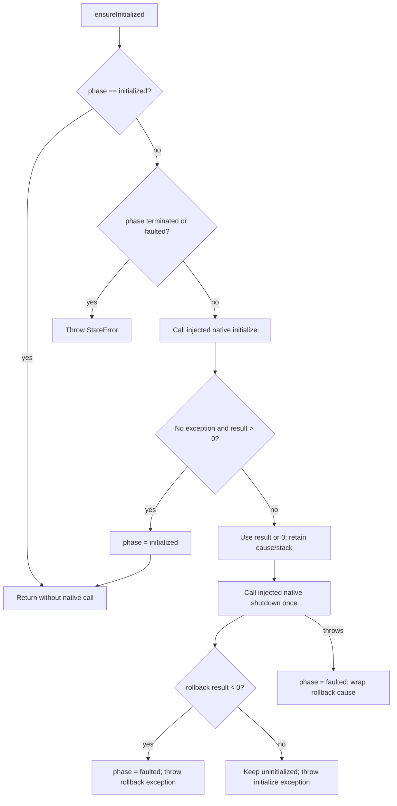

# `ensureInitialized` Function

```mermaid
flowchart TD
  Start["ensureInitialized"] --> Initialized{"phase == initialized?"}
  Initialized -- yes --> Return["Return without native call"]
  Initialized -- no --> Enter{"phase terminated or faulted?"}
  Enter -- yes --> Reject["Throw StateError"]
  Enter -- no --> Init["Call injected native initialize"]
  Init --> Outcome{"No exception and result > 0?"}
  Outcome -- yes --> Commit["phase = initialized"] --> Return
  Outcome -- no --> Capture["Use result or 0; retain cause/stack"]
  Capture --> Rollback["Call injected native shutdown once"]
  Rollback --> Negative{"rollback result < 0?"}
  Negative -- yes --> Fault["phase = faulted; throw rollback exception"]
  Negative -- no --> InitError["Keep uninitialized; throw initialize exception"]
  Rollback -->|throws| FaultThrow["phase = faulted; wrap rollback cause"]
```

🟢 CONFIRMED: only a positive initialization result commits the isolate lease. Successful compensating rollback permits retry; ambiguous rollback faults terminally.

