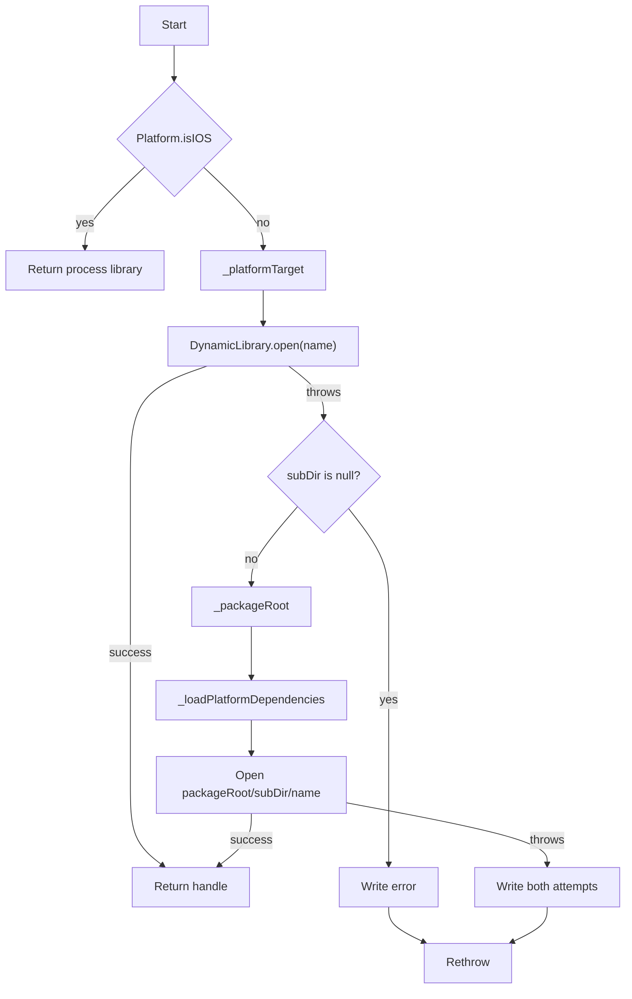

# `_loadLibrary` Function

```mermaid
flowchart TD
  Start --> IOS{"Platform.isIOS"}
  IOS -- yes --> Process["Return process library"]
  IOS -- no --> Platform["_platformTarget"]
  Platform --> Open1["DynamicLibrary.open(name)"]
  Open1 -->|success| Return["Return handle"]
  Open1 -->|throws| Subdir{"subDir is null?"}
  Subdir -- yes --> Log1["Write error"] --> Throw["Rethrow"]
  Subdir -- no --> Resolve["_packageRoot"]
  Resolve --> Preload["_loadPlatformDependencies"]
  Preload --> Open2["Open packageRoot/subDir/name"]
  Open2 -->|success| Return
  Open2 -->|throws| Log2["Write both attempts"] --> Throw
```

