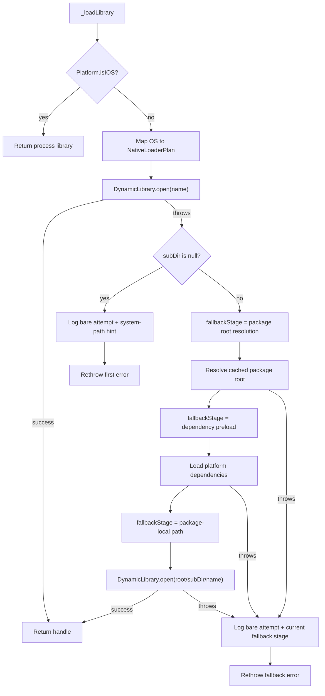

# `_loadLibrary` Function

🟢 CONFIRMED: iOS bypasses plan selection; Android has a null subdirectory and therefore no package fallback. 🔴 GAP: the feature-005 success probe does not emit the loaded handle path, so process success alone cannot distinguish bare-name success from package fallback success.
