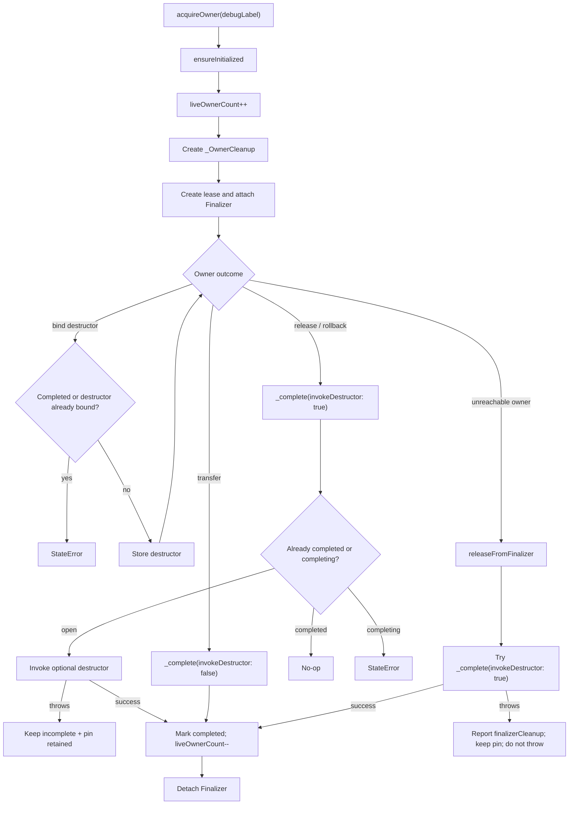

# Persistent Owner Lease Flow

🟢 CONFIRMED: destructor success or transfer is required before unpinning. 🟡 INFERRED: consumers must choose the correct completion path for each native ownership contract; external call sites were not inspected.
