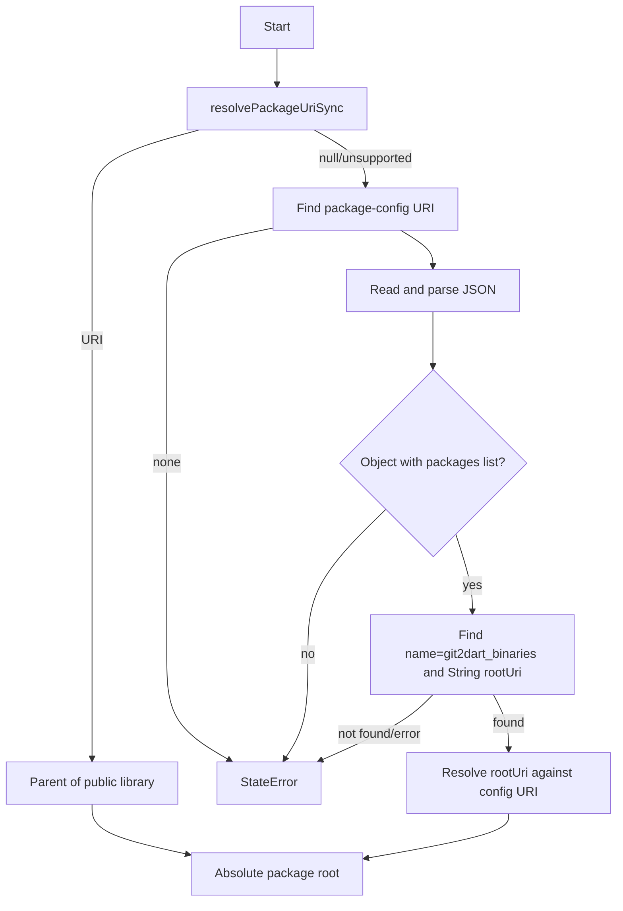

# `_resolvePackageRoot` Function

```mermaid
flowchart TD
  Start --> IsolateResolve["resolvePackageUriSync"]
  IsolateResolve -->|URI| UriRoot["Parent of public library"] --> Return["Absolute package root"]
  IsolateResolve -->|null/unsupported| ConfigUri["Find package-config URI"]
  ConfigUri -->|none| Fail["StateError"]
  ConfigUri --> Read["Read and parse JSON"]
  Read --> Valid{"Object with packages list?"}
  Valid -- no --> Fail
  Valid -- yes --> Scan["Find name=git2dart_binaries and String rootUri"]
  Scan -->|found| Resolve["Resolve rootUri against config URI"] --> Return
  Scan -->|not found/error| Fail
```

