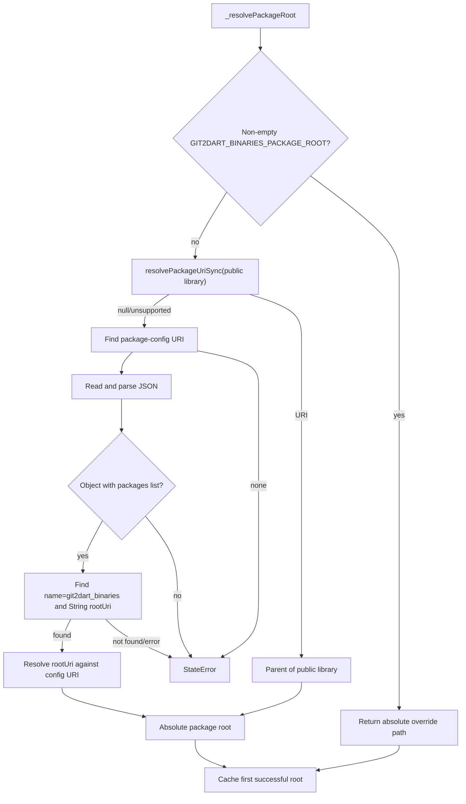

# `_resolvePackageRoot` Function

🟢 CONFIRMED: package-config URI discovery tries isolate metadata, `DART_PACKAGE_CONFIG`, then `--packages=`. Malformed/missing config data collapses to no result before the final `StateError`.
