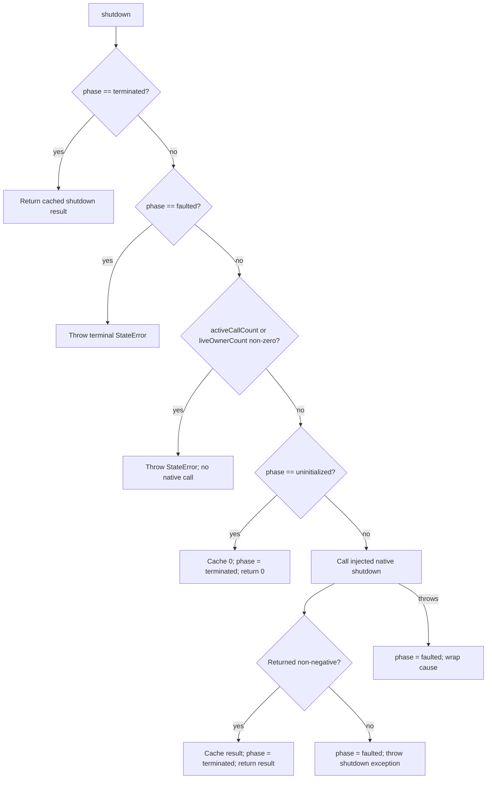

# `shutdown` Function

🟢 CONFIRMED: successful shutdown is isolate-terminal and idempotent, while positive remaining native counts are valid return values. 🔴 GAP: no current test traces two real isolates sharing one process-global libgit2 counter.
