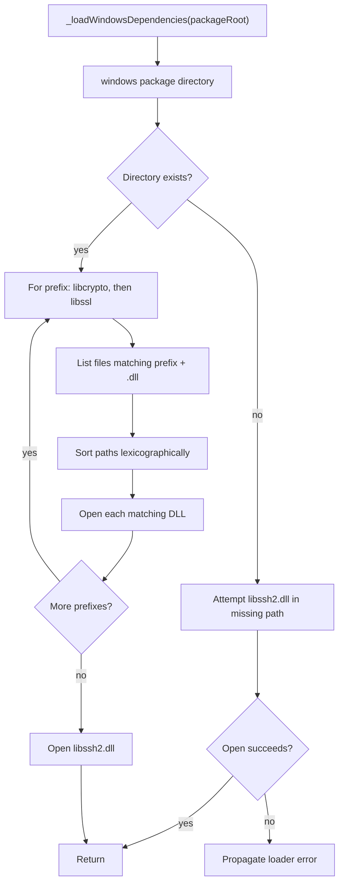

# `_loadWindowsDependencies` Function

🟢 CONFIRMED: OpenSSL matches are case-normalized by filename prefix and `.dll` extension before sorting. Any listing/open failure is logged by the caller and rethrown.
