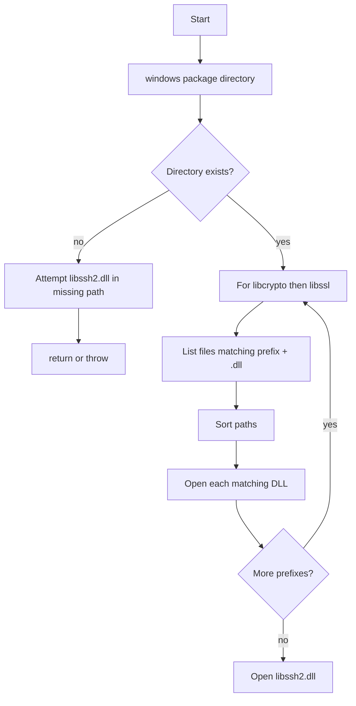

# `_loadWindowsDependencies` Function

```mermaid
flowchart TD
  Start --> Dir["windows package directory"]
  Dir --> Exists{"Directory exists?"}
  Exists -- no --> Missing["Attempt libssh2.dll in missing path"] --> Return["return or throw"]
  Exists -- yes --> Prefix["For libcrypto then libssl"]
  Prefix --> List["List files matching prefix + .dll"]
  List --> Sort["Sort paths"]
  Sort --> OpenEach["Open each matching DLL"]
  OpenEach --> Next{"More prefixes?"}
  Next -- yes --> Prefix
  Next -- no --> SSH["Open libssh2.dll"]
```

