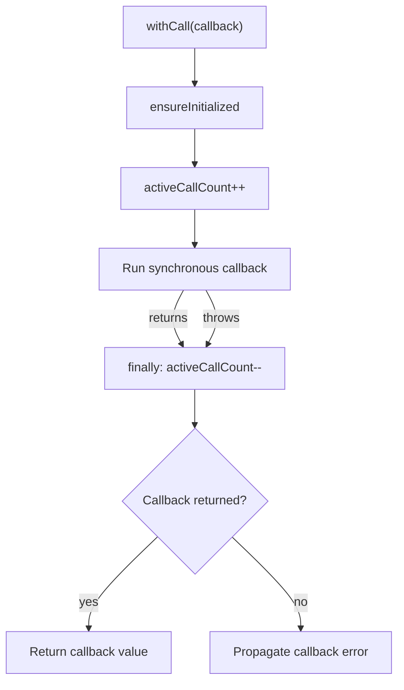

# `withCall` Function

🟢 CONFIRMED: the transient count always balances through `finally`. Shutdown attempted from inside the callback sees a non-zero active count and fails before native shutdown.

