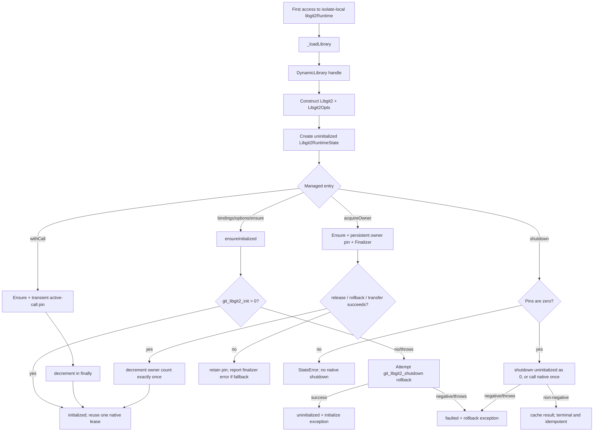

# Native Loader and Lifecycle Flow

🟢 CONFIRMED: production source implements the managed state and pin transitions above. 🔴 GAP: injected local tests do not establish cross-isolate native reference counts, deployed consumer cleanup, or hosted execution.
