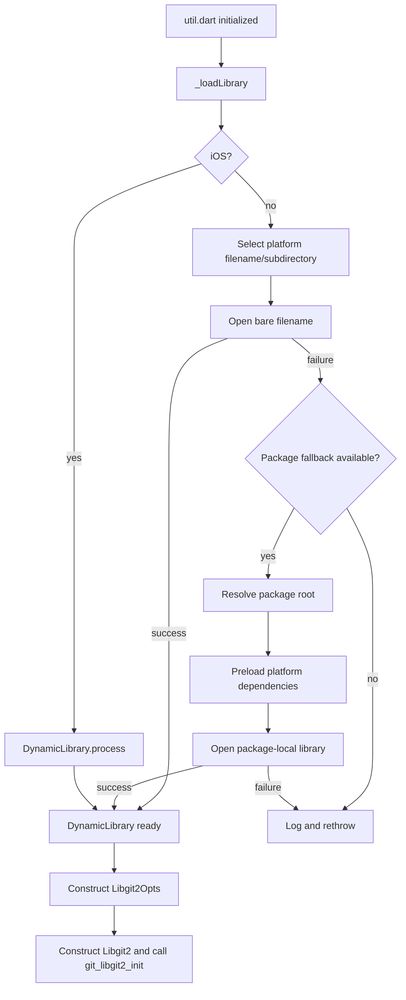

# Native Loader and Lifecycle Flow

```mermaid
flowchart TD
  Import["util.dart initialized"] --> Load["_loadLibrary"]
  Load --> IOS{"iOS?"}
  IOS -- yes --> Process["DynamicLibrary.process"]
  IOS -- no --> Target["Select platform filename/subdirectory"]
  Target --> First["Open bare filename"]
  First -->|success| Ready["DynamicLibrary ready"]
  First -->|failure| Fallback{"Package fallback available?"}
  Fallback -- no --> Rethrow["Log and rethrow"]
  Fallback -- yes --> Root["Resolve package root"]
  Root --> Deps["Preload platform dependencies"]
  Deps --> Second["Open package-local library"]
  Second -->|failure| Rethrow
  Second -->|success| Ready
  Process --> Ready
  Ready --> Options["Construct Libgit2Opts"]
  Options --> Init["Construct Libgit2 and call git_libgit2_init"]
```

