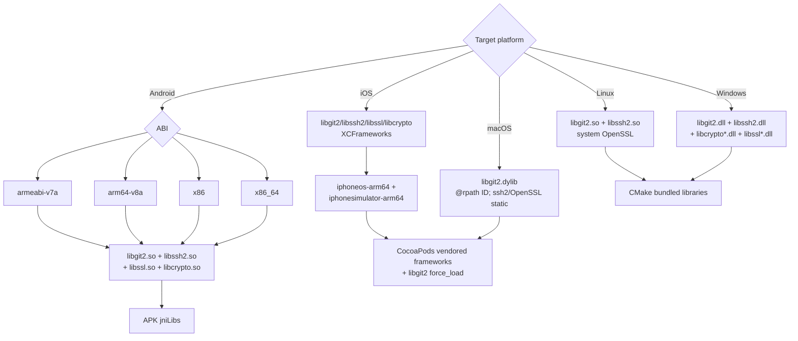

# Platform Artifact Selection

```mermaid
flowchart TD
  Platform{"Target platform"}
  Platform -->|Android| ABI{"ABI"}
  ABI --> A1["armeabi-v7a"]
  ABI --> A2["arm64-v8a"]
  ABI --> A3["x86"]
  ABI --> A4["x86_64"]
  A1 --> AS["libgit2.so + libssh2.so<br/>+ libssl.so + libcrypto.so"]
  A2 --> AS
  A3 --> AS
  A4 --> AS
  Platform -->|iOS| I["libgit2/libssh2/libssl/libcrypto<br/>XCFrameworks"]
  I --> Slices["iphoneos-arm64 +<br/>iphonesimulator-arm64"]
  Platform -->|macOS| M["libgit2.dylib<br/>@rpath ID; ssh2/OpenSSL static"]
  Platform -->|Linux| L["libgit2.so + libssh2.so<br/>system OpenSSL"]
  Platform -->|Windows| W["libgit2.dll + libssh2.dll<br/>+ libcrypto*.dll + libssl*.dll"]
  AS --> AndroidBundle["APK jniLibs"]
  Slices --> Cocoa["CocoaPods vendored frameworks<br/>+ libgit2 force_load"]
  M --> Cocoa
  L --> Desktop["CMake bundled libraries"]
  W --> Desktop
```

🟢 Artifact names and target locations are source-confirmed. 🔴 The generated payloads are absent from the checkout.
