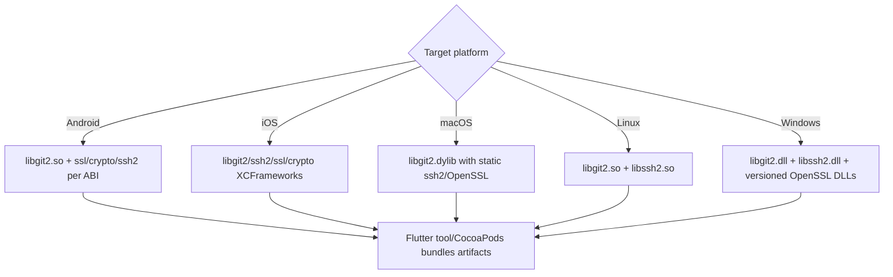

# Platform Artifact Selection

```mermaid
flowchart TD
  Platform{"Target platform"}
  Platform -->|Android| A["libgit2.so + ssl/crypto/ssh2 per ABI"]
  Platform -->|iOS| I["libgit2/ssh2/ssl/crypto XCFrameworks"]
  Platform -->|macOS| M["libgit2.dylib with static ssh2/OpenSSL"]
  Platform -->|Linux| L["libgit2.so + libssh2.so"]
  Platform -->|Windows| W["libgit2.dll + libssh2.dll + versioned OpenSSL DLLs"]
  A --> Bundle["Flutter tool/CocoaPods bundles artifacts"]
  I --> Bundle
  M --> Bundle
  L --> Bundle
  W --> Bundle
```

