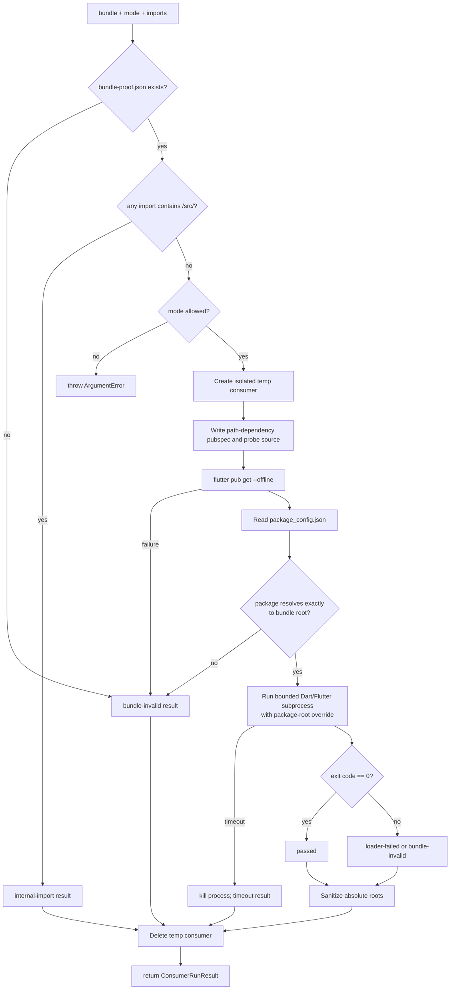

# `runCleanConsumer` Flow

```mermaid
flowchart TD
  Start["bundle + mode + imports"] --> Proof{"bundle-proof.json exists?"}
  Proof -- no --> Invalid["bundle-invalid result"]
  Proof -- yes --> Imports{"any import contains /src/?"}
  Imports -- yes --> Internal["internal-import result"]
  Imports -- no --> Mode{"mode allowed?"}
  Mode -- no --> Arg["throw ArgumentError"]
  Mode -- yes --> Temp["Create isolated temp consumer"]
  Temp --> Pubspec["Write path-dependency pubspec and probe source"]
  Pubspec --> Get["flutter pub get --offline"]
  Get -->|failure| Invalid
  Get --> Resolve["Read package_config.json"]
  Resolve --> Exact{"package resolves exactly<br/>to bundle root?"}
  Exact -- no --> Invalid
  Exact -- yes --> Run["Run bounded Dart/Flutter subprocess<br/>with package-root override"]
  Run -->|timeout| Timeout["kill process; timeout result"]
  Run --> Classify{"exit code == 0?"}
  Classify -- yes --> Passed["passed"]
  Classify -- no --> Failed["loader-failed or bundle-invalid"]
  Passed --> Sanitize["Sanitize absolute roots"]
  Failed --> Sanitize
  Timeout --> Cleanup["Delete temp consumer"]
  Invalid --> Cleanup
  Internal --> Cleanup
  Sanitize --> Cleanup
  Cleanup --> Return["return ConsumerRunResult"]
```
