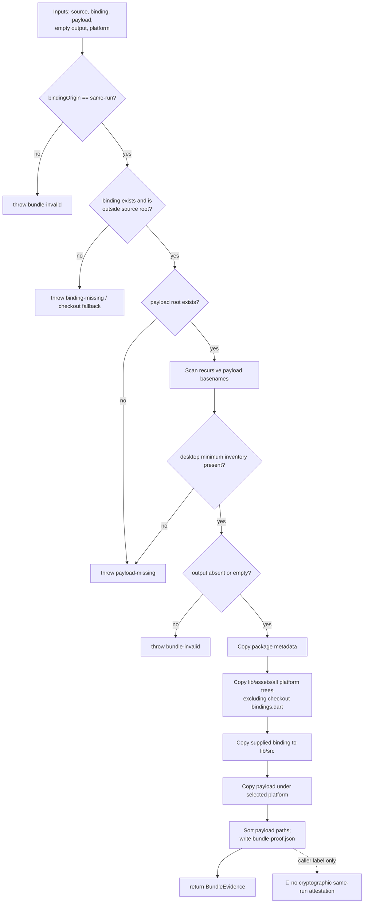

# `assembleConsumerBundle` Flow

```mermaid
flowchart TD
  Start["Inputs: source, binding, payload,<br/>empty output, platform"] --> Origin{"bindingOrigin == same-run?"}
  Origin -- no --> RejectOrigin["throw bundle-invalid"]
  Origin -- yes --> Binding{"binding exists and is<br/>outside source root?"}
  Binding -- no --> RejectBinding["throw binding-missing / checkout fallback"]
  Binding -- yes --> Payload{"payload root exists?"}
  Payload -- no --> RejectPayload["throw payload-missing"]
  Payload -- yes --> Inventory["Scan recursive payload basenames"]
  Inventory --> Required{"desktop minimum inventory present?"}
  Required -- no --> RejectPayload
  Required -- yes --> Output{"output absent or empty?"}
  Output -- no --> RejectOutput["throw bundle-invalid"]
  Output -- yes --> CopyMeta["Copy package metadata"]
  CopyMeta --> CopyTrees["Copy lib/assets/all platform trees<br/>excluding checkout bindings.dart"]
  CopyTrees --> InjectBinding["Copy supplied binding to lib/src"]
  InjectBinding --> Overlay["Copy payload under selected platform"]
  Overlay --> Evidence["Sort payload paths;<br/>write bundle-proof.json"]
  Evidence --> Return["return BundleEvidence"]
  Evidence -. "caller label only" .-> Gap["🔴 no cryptographic same-run attestation"]
```
