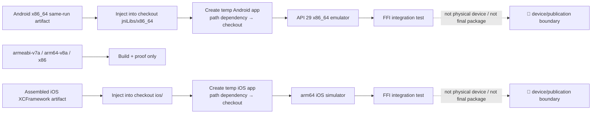

# Mobile Packaging Integration Routes

```mermaid
flowchart LR
  AndroidArtifact["Android x86_64 same-run artifact"] --> AndroidCheckout["Inject into checkout jniLibs/x86_64"]
  AndroidCheckout --> AndroidApp["Create temp Android app<br/>path dependency → checkout"]
  AndroidApp --> Emulator["API 29 x86_64 emulator"]
  Emulator --> AndroidTests["FFI integration test"]
  OtherABI["armeabi-v7a / arm64-v8a / x86"] --> BuildProof["Build + proof only"]
  IOSArtifact["Assembled iOS XCFramework artifact"] --> IOSCheckout["Inject into checkout ios/"]
  IOSCheckout --> IOSApp["Create temp iOS app<br/>path dependency → checkout"]
  IOSApp --> Simulator["arm64 iOS simulator"]
  Simulator --> IOSTests["FFI integration test"]
  AndroidTests -. "not physical device / not final package" .-> GapA["🔴 device/publication boundary"]
  IOSTests -. "not physical device / not final package" .-> GapI["🔴 device/publication boundary"]
```

The mobile applications consume an artifact-populated checkout, not the disposable final-package bundle used for Linux in the publish job.
