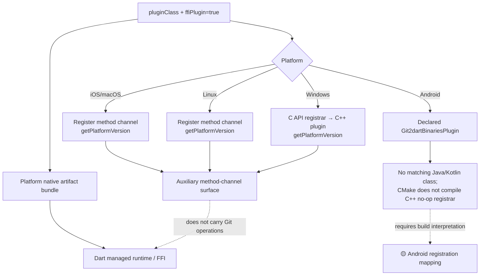

# Flutter Plugin Registration versus FFI Payload

```mermaid
flowchart TD
  Pubspec["pluginClass + ffiPlugin=true"] --> Platform{"Platform"}
  Platform -->|iOS/macOS| Swift["Register method channel<br/>getPlatformVersion"]
  Platform -->|Linux| GLib["Register method channel<br/>getPlatformVersion"]
  Platform -->|Windows| CApi["C API registrar → C++ plugin<br/>getPlatformVersion"]
  Platform -->|Android| Declared["Declared Git2dartBinariesPlugin"]
  Declared --> Missing["No matching Java/Kotlin class;<br/>CMake does not compile C++ no-op registrar"]
  Swift --> Method["Auxiliary method-channel surface"]
  GLib --> Method
  CApi --> Method
  Pubspec --> Native["Platform native artifact bundle"]
  Native --> DartFFI["Dart managed runtime / FFI"]
  Method -. "does not carry Git operations" .-> DartFFI
  Missing -. "requires build interpretation" .-> Gap["🟡 Android registration mapping"]
```
