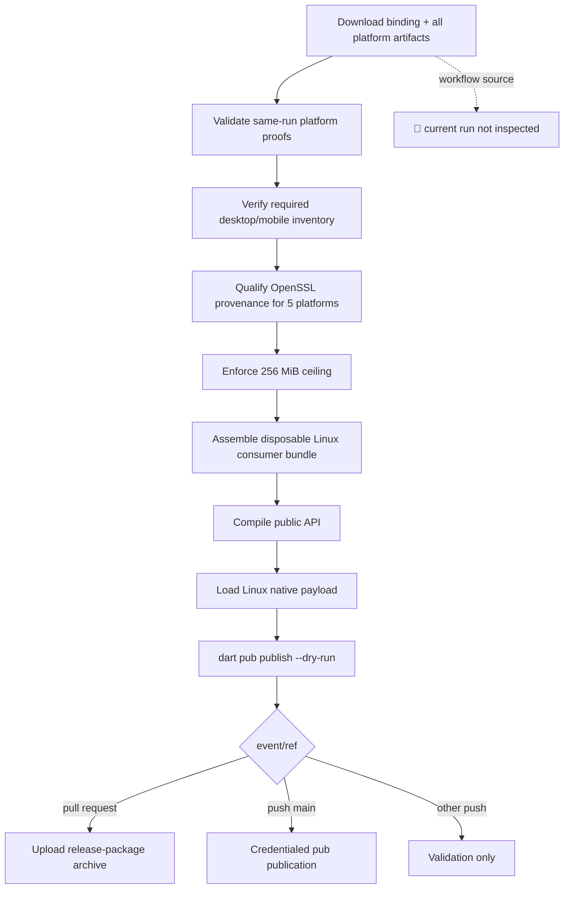

# Expanded Package Assembly and Eligibility

```mermaid
flowchart TD
  Download["Download binding + all platform artifacts"] --> Proof["Validate same-run platform proofs"]
  Proof --> Inventory["Verify required desktop/mobile inventory"]
  Inventory --> Provenance["Qualify OpenSSL provenance for 5 platforms"]
  Provenance --> Size["Enforce 256 MiB ceiling"]
  Size --> LinuxBundle["Assemble disposable Linux consumer bundle"]
  LinuxBundle --> Compile["Compile public API"]
  Compile --> Load["Load Linux native payload"]
  Load --> DryRun["dart pub publish --dry-run"]
  DryRun --> Event{"event/ref"}
  Event -->|pull request| ReleaseArtifact["Upload release-package archive"]
  Event -->|push main| Publish["Credentialed pub publication"]
  Event -->|other push| NoPublish["Validation only"]
  Download -. "workflow source" .-> Current["🔴 current run not inspected"]
```
