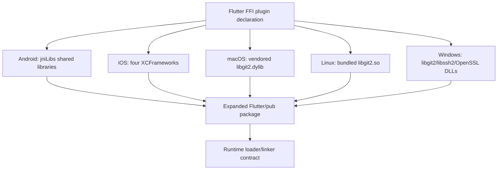

# Platform Packaging Flow

```mermaid
flowchart TD
  Pubspec["Flutter FFI plugin declaration"] --> Android["Android: jniLibs shared libraries"]
  Pubspec --> IOS["iOS: four XCFrameworks"]
  Pubspec --> Mac["macOS: vendored libgit2.dylib"]
  Pubspec --> Linux["Linux: bundled libgit2.so"]
  Pubspec --> Windows["Windows: libgit2/libssh2/OpenSSL DLLs"]
  Android --> App["Expanded Flutter/pub package"]
  IOS --> App
  Mac --> App
  Linux --> App
  Windows --> App
  App --> Loader["Runtime loader/linker contract"]
```

