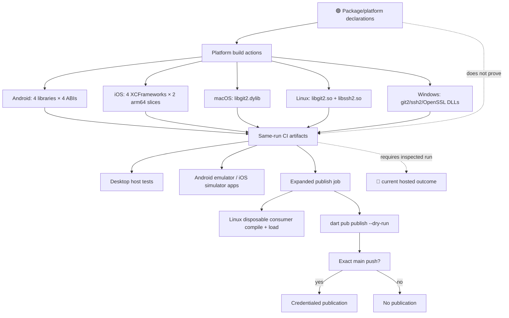

# Platform Packaging Flow

```mermaid
flowchart TD
  Source["🟢 Package/platform declarations"] --> Build["Platform build actions"]
  Build --> A["Android: 4 libraries × 4 ABIs"]
  Build --> I["iOS: 4 XCFrameworks × 2 arm64 slices"]
  Build --> M["macOS: libgit2.dylib"]
  Build --> L["Linux: libgit2.so + libssh2.so"]
  Build --> W["Windows: git2/ssh2/OpenSSL DLLs"]
  A --> Artifacts["Same-run CI artifacts"]
  I --> Artifacts
  M --> Artifacts
  L --> Artifacts
  W --> Artifacts
  Artifacts --> HostTests["Desktop host tests"]
  Artifacts --> Mobile["Android emulator / iOS simulator apps"]
  Artifacts --> Publish["Expanded publish job"]
  Publish --> Consumer["Linux disposable consumer compile + load"]
  Publish --> DryRun["dart pub publish --dry-run"]
  DryRun --> Conditional["Exact main push?"]
  Conditional -- yes --> External["Credentialed publication"]
  Conditional -- no --> Stop["No publication"]
  Source -. "does not prove" .-> Artifacts
  Artifacts -. "requires inspected run" .-> Gap["🔴 current hosted outcome"]
```

The graph separates configuration reachability from artifact existence and execution. No current same-run hosted result was inspected during this module pass.
