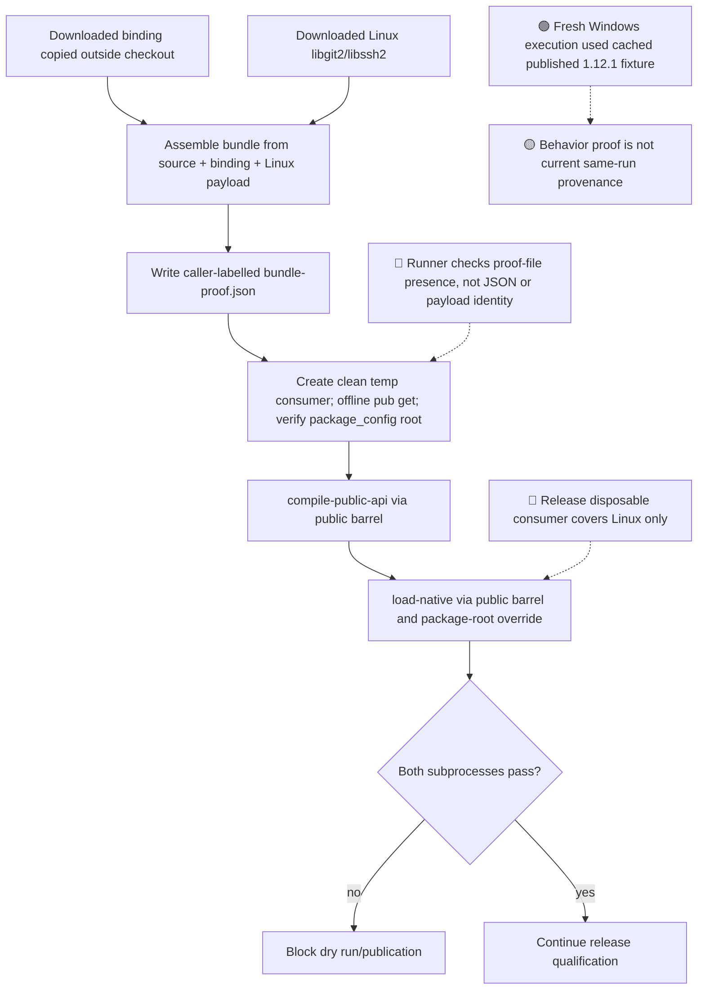

# Release Disposable Consumer Gate

```mermaid
flowchart TD
  Binding["Downloaded binding copied outside checkout"] --> Assemble["Assemble bundle from source + binding + Linux payload"]
  Linux["Downloaded Linux libgit2/libssh2"] --> Assemble
  Assemble --> Evidence["Write caller-labelled bundle-proof.json"]
  Evidence --> Compile["Create clean temp consumer; offline pub get; verify package_config root"]
  Compile --> Public["compile-public-api via public barrel"]
  Public --> Load["load-native via public barrel and package-root override"]
  Load --> Pass{"Both subprocesses pass?"}
  Pass -- no --> Block["Block dry run/publication"]
  Pass -- yes --> Continue["Continue release qualification"]
  EvidenceGap["🔴 Runner checks proof-file presence, not JSON or payload identity"] -.-> Compile
  PlatformGap["🔴 Release disposable consumer covers Linux only"] -.-> Load
  Local["🟢 Fresh Windows execution used cached published 1.12.1 fixture"] -.-> Boundary["🟡 Behavior proof is not current same-run provenance"]
```

