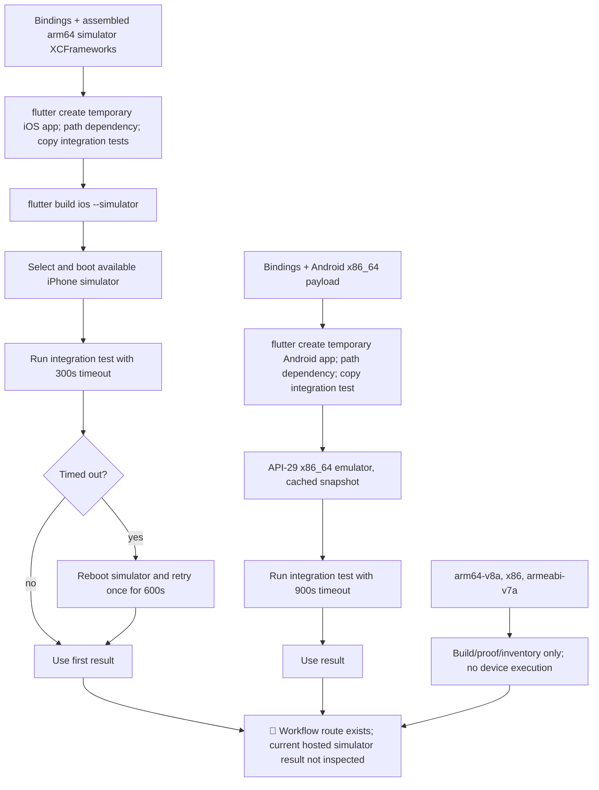

# Mobile Hosted Runtime Routes

```mermaid
flowchart TD
  IOSArtifact["Bindings + assembled arm64 simulator XCFrameworks"] --> IOSApp["flutter create temporary iOS app; path dependency; copy integration tests"]
  IOSApp --> IOSBuild["flutter build ios --simulator"]
  IOSBuild --> IOSBoot["Select and boot available iPhone simulator"]
  IOSBoot --> IOSRun["Run integration test with 300s timeout"]
  IOSRun --> IOSTimeout{"Timed out?"}
  IOSTimeout -- yes --> Retry["Reboot simulator and retry once for 600s"]
  IOSTimeout -- no --> IOSResult["Use first result"]
  Retry --> IOSResult
  AndroidArtifact["Bindings + Android x86_64 payload"] --> AndroidApp["flutter create temporary Android app; path dependency; copy integration test"]
  AndroidApp --> Emulator["API-29 x86_64 emulator, cached snapshot"]
  Emulator --> AndroidRun["Run integration test with 900s timeout"]
  AndroidRun --> AndroidResult["Use result"]
  Other["arm64-v8a, x86, armeabi-v7a"] --> StaticOnly["Build/proof/inventory only; no device execution"]
  IOSResult --> Boundary["🔴 Workflow route exists; current hosted simulator result not inspected"]
  AndroidResult --> Boundary
  StaticOnly --> Boundary
```

