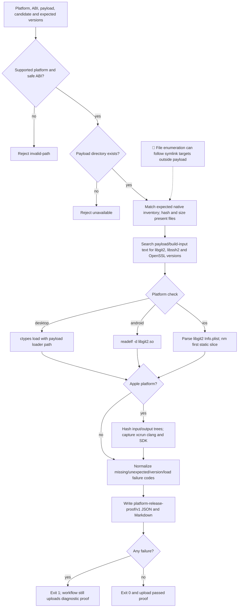

# Platform Release Proof Creation

```mermaid
flowchart TD
  Args["Platform, ABI, payload, candidate and expected versions"] --> Safe{"Supported platform and safe ABI?"}
  Safe -- no --> Reject["Reject invalid-path"]
  Safe -- yes --> Root{"Payload directory exists?"}
  Root -- no --> RejectUnavailable["Reject unavailable"]
  Root -- yes --> Inventory["Match expected native inventory; hash and size present files"]
  Inventory --> Versions["Search payload/build-input text for libgit2, libssh2 and OpenSSL versions"]
  Versions --> Linkage{"Platform check"}
  Linkage -- desktop --> Ctypes["ctypes load with payload loader path"]
  Linkage -- android --> Readelf["readelf -d libgit2.so"]
  Linkage -- ios --> IOS["Parse libgit2 Info.plist; nm first static slice"]
  Ctypes --> Apple{"Apple platform?"}
  Readelf --> Apple
  IOS --> Apple
  Apple -- yes --> Attest["Hash input/output trees; capture xcrun clang and SDK"]
  Apple -- no --> Failures["Normalize missing/unexpected/version/load failure codes"]
  Attest --> Failures
  Failures --> Record["Write platform-release-proof/v1 JSON and Markdown"]
  Record --> Status{"Any failure?"}
  Status -- yes --> Exit1["Exit 1; workflow still uploads diagnostic proof"]
  Status -- no --> Exit0["Exit 0 and upload passed proof"]
  Symlink["🔴 File enumeration can follow symlink targets outside payload"] -.-> Inventory
```

