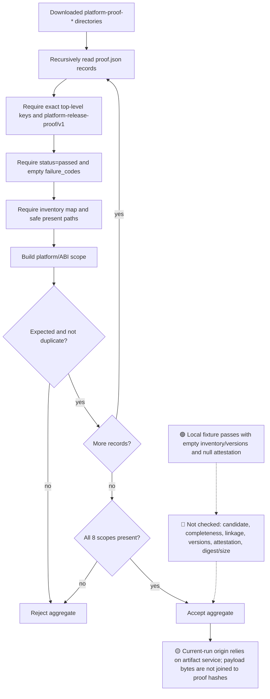

# Aggregate Platform Proof Validation

```mermaid
flowchart TD
  Root["Downloaded platform-proof-* directories"] --> Scan["Recursively read proof.json records"]
  Scan --> Shape["Require exact top-level keys and platform-release-proof/v1"]
  Shape --> Passed["Require status=passed and empty failure_codes"]
  Passed --> Inventory["Require inventory map and safe present paths"]
  Inventory --> Scope["Build platform/ABI scope"]
  Scope --> Unique{"Expected and not duplicate?"}
  Unique -- no --> Reject["Reject aggregate"]
  Unique -- yes --> More{"More records?"}
  More -- yes --> Scan
  More -- no --> Complete{"All 8 scopes present?"}
  Complete -- no --> Reject
  Complete -- yes --> Accept["Accept aggregate"]
  Missing["🔴 Not checked: candidate, completeness, linkage, versions, attestation, digest/size"] -.-> Accept
  Fixture["🟢 Local fixture passes with empty inventory/versions and null attestation"] -.-> Missing
  Accept --> Boundary["🟡 Current-run origin relies on artifact service; payload bytes are not joined to proof hashes"]
```

