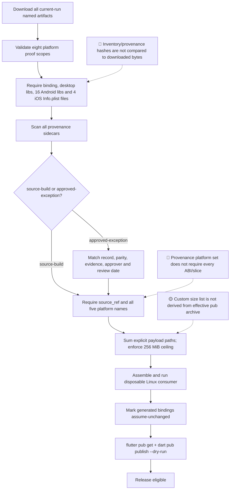

# Release Eligibility Gates

```mermaid
flowchart TD
  Download["Download all current-run named artifacts"] --> Proof["Validate eight platform proof scopes"]
  Proof --> Inventory["Require binding, desktop libs, 16 Android libs and 4 iOS Info.plist files"]
  Inventory --> Provenance["Scan all provenance sidecars"]
  Provenance --> Kind{"source-build or approved-exception?"}
  Kind -- source-build --> Platforms["Require source_ref and all five platform names"]
  Kind -- approved-exception --> Exception["Match record, parity, evidence, approver and review date"]
  Exception --> Platforms
  Platforms --> Size["Sum explicit payload paths; enforce 256 MiB ceiling"]
  Size --> Consumer["Assemble and run disposable Linux consumer"]
  Consumer --> Ignore["Mark generated bindings assume-unchanged"]
  Ignore --> DryRun["flutter pub get + dart pub publish --dry-run"]
  DryRun --> Eligible["Release eligible"]
  HashGap["🔴 Inventory/provenance hashes are not compared to downloaded bytes"] -.-> Inventory
  CoverageGap["🔴 Provenance platform set does not require every ABI/slice"] -.-> Platforms
  SizeGap["🟡 Custom size list is not derived from effective pub archive"] -.-> Size
```

