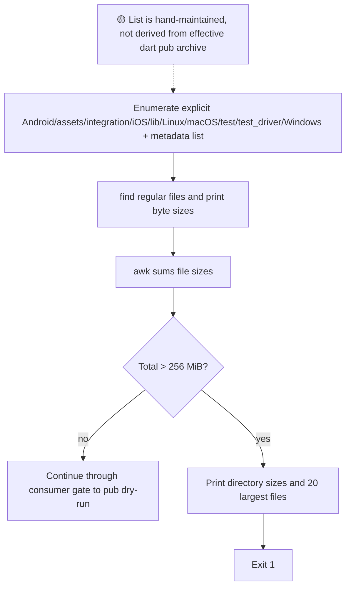

# Expanded Package Size Gate

```mermaid
flowchart TD
  Start["Enumerate explicit Android/assets/integration/iOS/lib/Linux/macOS/test/test_driver/Windows + metadata list"] --> Find["find regular files and print byte sizes"]
  Find --> Sum["awk sums file sizes"]
  Sum --> Compare{"Total > 256 MiB?"}
  Compare -- no --> Continue["Continue through consumer gate to pub dry-run"]
  Compare -- yes --> Diagnostic["Print directory sizes and 20 largest files"]
  Diagnostic --> Exit["Exit 1"]
  Gap["🟡 List is hand-maintained, not derived from effective dart pub archive"] -.-> Start
```
