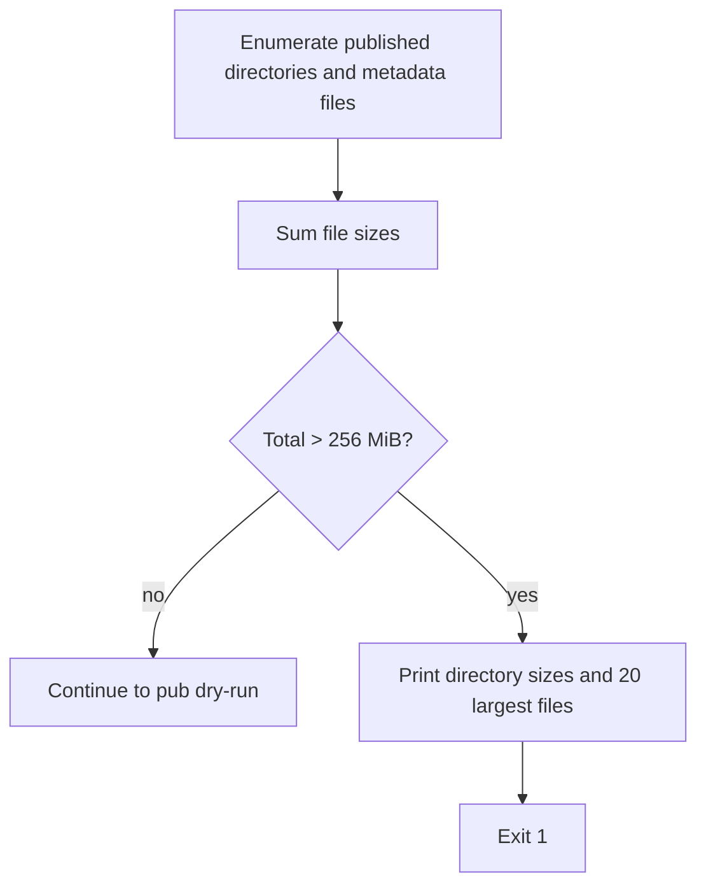

# Expanded Package Size Gate

```mermaid
flowchart TD
  Start["Enumerate published directories and metadata files"] --> Sum["Sum file sizes"]
  Sum --> Compare{"Total > 256 MiB?"}
  Compare -- no --> Continue["Continue to pub dry-run"]
  Compare -- yes --> Diagnostic["Print directory sizes and 20 largest files"]
  Diagnostic --> Exit["Exit 1"]
```

