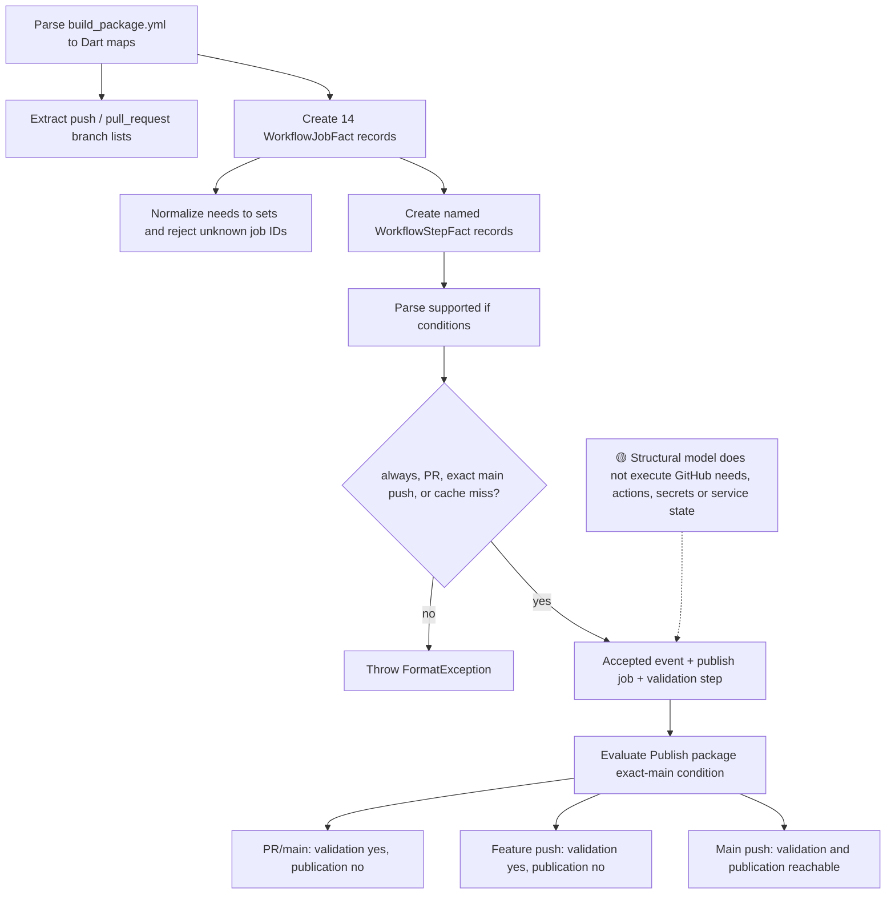

# Parsed Workflow Policy

```mermaid
flowchart TD
  YAML["Parse build_package.yml to Dart maps"] --> Events["Extract push / pull_request branch lists"]
  YAML --> Jobs["Create 14 WorkflowJobFact records"]
  Jobs --> Needs["Normalize needs to sets and reject unknown job IDs"]
  Jobs --> Steps["Create named WorkflowStepFact records"]
  Steps --> Condition["Parse supported if conditions"]
  Condition --> Supported{"always, PR, exact main push, or cache miss?"}
  Supported -- no --> Reject["Throw FormatException"]
  Supported -- yes --> ValidateReach["Accepted event + publish job + validation step"]
  ValidateReach --> PublishReach["Evaluate Publish package exact-main condition"]
  PublishReach --> PR["PR/main: validation yes, publication no"]
  PublishReach --> Feature["Feature push: validation yes, publication no"]
  PublishReach --> Main["Main push: validation and publication reachable"]
  Simplified["🟡 Structural model does not execute GitHub needs, actions, secrets or service state"] -.-> ValidateReach
```

