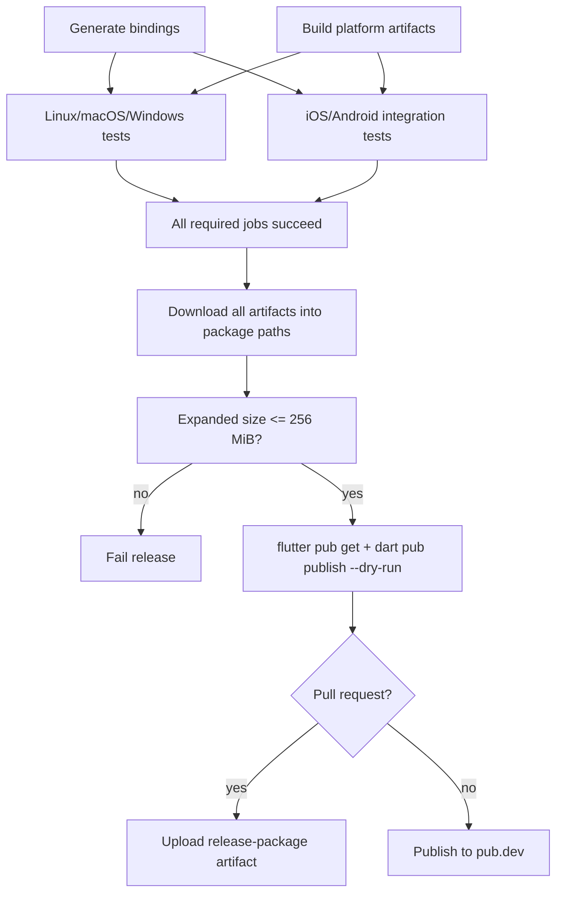

# Validation and Release Assembly Flow

```mermaid
flowchart TD
  Bindings["Generate bindings"] --> DesktopTests["Linux/macOS/Windows tests"]
  Native["Build platform artifacts"] --> DesktopTests
  Bindings --> MobileTests["iOS/Android integration tests"]
  Native --> MobileTests
  DesktopTests --> Gate["All required jobs succeed"]
  MobileTests --> Gate
  Gate --> Download["Download all artifacts into package paths"]
  Download --> Size["Expanded size <= 256 MiB?"]
  Size -- no --> Fail["Fail release"]
  Size -- yes --> DryRun["flutter pub get + dart pub publish --dry-run"]
  DryRun --> Event{"Pull request?"}
  Event -- yes --> PR["Upload release-package artifact"]
  Event -- no --> Publish["Publish to pub.dev"]
```

