# Permissions, Capabilities, and Trust Boundaries

## RBAC applicability

**Application RBAC/ACL is not applicable.** This repository contains no account model, authenticated user, tenant, session, database permission, role enum, authorization middleware, or data-access filter. A dependency consumer that can execute Dart code can call the package's public API; this package adds no user-level authorization layer.

| Application role | Represented? | Effective permission |
|---|---:|---|
| End user | No | None modeled here |
| Application user/admin | No | None modeled here |
| Tenant/service account | No | None modeled here |
| Package consumer | Yes, as code | May call public Dart/FFI APIs available through dependency resolution |

🟢 Confirmed from the current source/configuration inventory. The matrices below document **automation capabilities and trust boundaries**, not application RBAC.

## Repository and workflow capability matrix

| Actor/context | Read source/specs | Change source/workflow | Run validation | Produce artifacts | Reach publish step | Access referenced secrets | Evidence boundary |
|---|---:|---:|---:|---:|---:|---:|---|
| Local reader | Yes | No implied authority | May run available local checks | Local/temp only | No | No | Static/local host only |
| Local contributor | Yes | Via local Git permissions | Yes | Local/temp only | No direct workflow authority | No repository secrets | Unpushed state is not hosted evidence |
| Pull-request workflow | Yes | Checked-out PR revision only | Yes | Temporary bindings/native/proof/release artifacts | No | Publisher step is unreachable | Fork approval/secret policy external |
| Non-main branch push workflow | Yes | Checked-out pushed revision only | Yes | Same-run artifacts/caches | Publish step unreachable | Publisher secrets not consumed by guarded step | Hosted validation if run observed |
| Exact main push workflow | Yes | Checked-out main revision only | Yes | Same-run artifacts/caches | Yes, after all gates | Pub.dev access/refresh secrets referenced | External token scope and registry result unproven |
| `generate_bindings` job | Yes | Generates untracked binding in job workspace | Generation checks | `cache-bindings` | No | None shown for generation | Header/tag and artifact routing authority |
| Platform build/test jobs | Yes | Build workspace only | Native/platform checks | Payload/proof/provenance artifacts | No | No publisher tokens | Runtime strength varies by platform |
| `publish_package` job | Yes | Assembles expanded checkout | Proof/inventory/provenance/size/bundle/dry-run | PR release artifact or publisher input | Conditional | Publisher tokens only at final main-push step | Current feature-005 run unobserved |
| Publisher action | Package workspace | External action implementation | `skipTests=true`; relies on prior gates | Uploads to pub.dev | Exact main push only | Access + refresh token inputs | Action integrity/token authorization external |

## Workflow authorization rules

1. 🟢 Workflow validation is modeled as reachable for pull requests and pushes to any branch.
2. 🟢 The credential-bearing publisher action is modeled as reachable only when `github.event_name == 'push'` and `github.ref == 'refs/heads/main'`.
3. 🟢 `publish_package` structurally depends on Linux, macOS, Windows, iOS, Android x86_64 tests, and other Android ABI builds.
4. 🟢 Proof, inventory, provenance, size, disposable consumer, and dry-run steps appear before publication.
5. 🟡 These rules are parsed from the checked-in YAML by a simplified fail-closed model; they do not prove GitHub service evaluation or that external repository settings require this workflow.
6. 🔴 Secret scopes, rotation, environment approval, branch protection, required checks, fork approvals, action pinning policy, and organization administrators are not repository-local facts.

## Native capability boundary

| Capability | Public/available surface | Guard in this package | Remaining risk |
|---|---|---|---|
| Load native code | Reading `libgit2Runtime`/exports | Platform selection and fail-closed loader | Native artifact authenticity/current origin not verified locally |
| Initialize/shutdown libgit2 | Managed runtime; raw generated methods technically exist | Checked phase machine, rollback, pin counts | External consumers can bypass the supported manager through generated ABI |
| Call arbitrary generated libgit2 ABI | Generated `Libgit2` public export | No sandbox/capability filter | Native memory/filesystem/network authority follows process permissions |
| Mutate process-global options | `Libgit2Opts` public methods | Typed adapters; one explicit range check | Most enum/range/nullability validity remains native-side |
| Extract Android CA asset | `AndroidSSLHelper` | Cache-after-write and retry | Applying TLS options and HTTPS success are consumer responsibilities |
| Create/validate cache manifests | Python CLI | Exact metadata/file hashes and safe relative paths | Symlink containment and one create-error path remain gaps |
| Create/validate platform proofs | Python CLI | Failure codes, scope/schema/status/path gates | Aggregate does not verify full semantics or payload identity |
| Assemble consumer bundle | Dart CLI/tool | Rejects checkout binding, undeclared origin label, missing payload, wrong package root | `same-run` is caller asserted; evidence file is not cryptographically verified |

## Filesystem, process, and diagnostic boundaries

- 🟢 Behavior fixtures use disposable roots, bounded subprocesses, recursive cleanup, and diagnostic root replacement.
- 🟢 Bundle consumers run from a separate temporary package and verify package-config resolution to the bundle.
- 🟢 Unsafe relative paths are rejected by cache, proof, and bundle helpers in their covered routes.
- 🟡 Loader and consumer processes inherit some ambient process environment; success alone does not prove native handle origin.
- 🔴 Native payload symlinks can be followed without a producer-root containment proof in platform evidence generation.
- 🔴 Sanitization is bounded to known roots/patterns and is not a general secret-redaction system.

## Supply-chain trust boundaries

```mermaid
flowchart LR
  H[Pinned upstream tags/headers] --> B[CI native builds + binding generation]
  B --> A[Workflow artifacts/cache]
  A --> P[Proof/provenance/inventory gates]
  P --> C[Disposable consumer + dry-run]
  C --> U[Publisher action]
  U --> R[pub.dev registry]

  H -. external tag authenticity gap .-> B
  A -. payload/proof identity gap .-> P
  C -. token/action authorization gap .-> U
  U -. current registry outcome gap .-> R
```

The repository pins versions and validates artifact shapes, but current evidence does not establish signed upstream tags, SBOM/signing, cryptographic provenance, exact proof-to-payload identity, publisher-action integrity, or registry acceptance.

## Security and permission gaps

1. 🔴 Exact pub.dev token scopes, owner, rotation, and revocation policy.
2. 🔴 GitHub environment/manual approval and branch-protection requirements for main publication.
3. 🔴 Fork workflow secret exposure/approval policy and organization-level permissions.
4. 🔴 Integrity/pinning policy for third-party actions, especially the publisher action.
5. 🔴 Signed upstream source verification, SBOM, release signing, and attestations.
6. 🔴 Consumer process filesystem/network permissions and sandboxing of native libgit2.
7. 🔴 Whether the neighboring `git2dart` restricts or safely manages the broad generated ABI.

