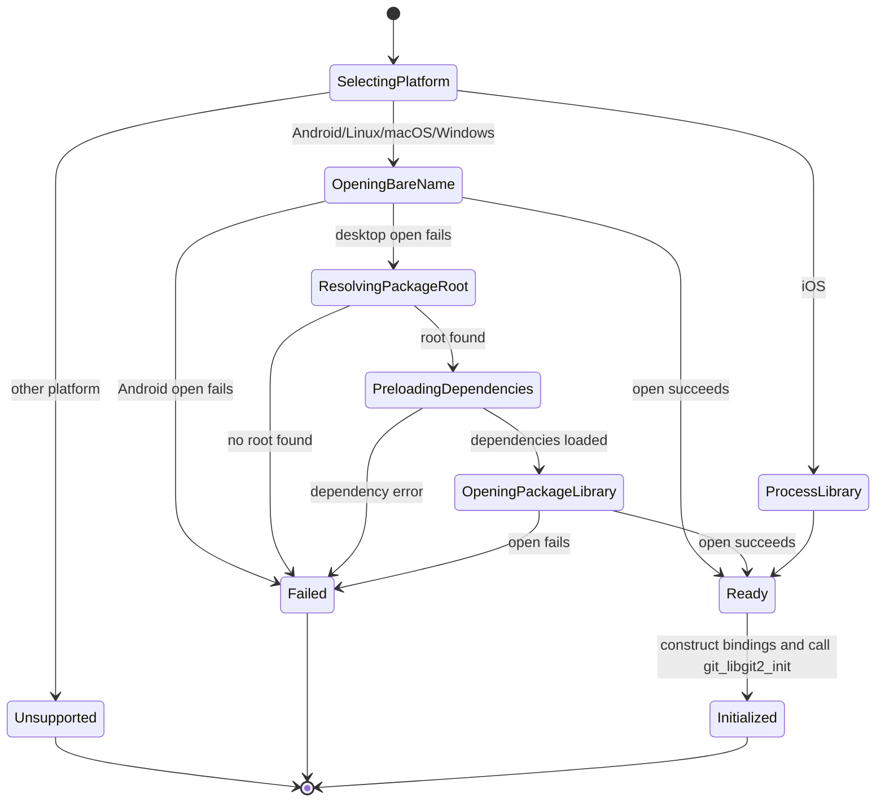
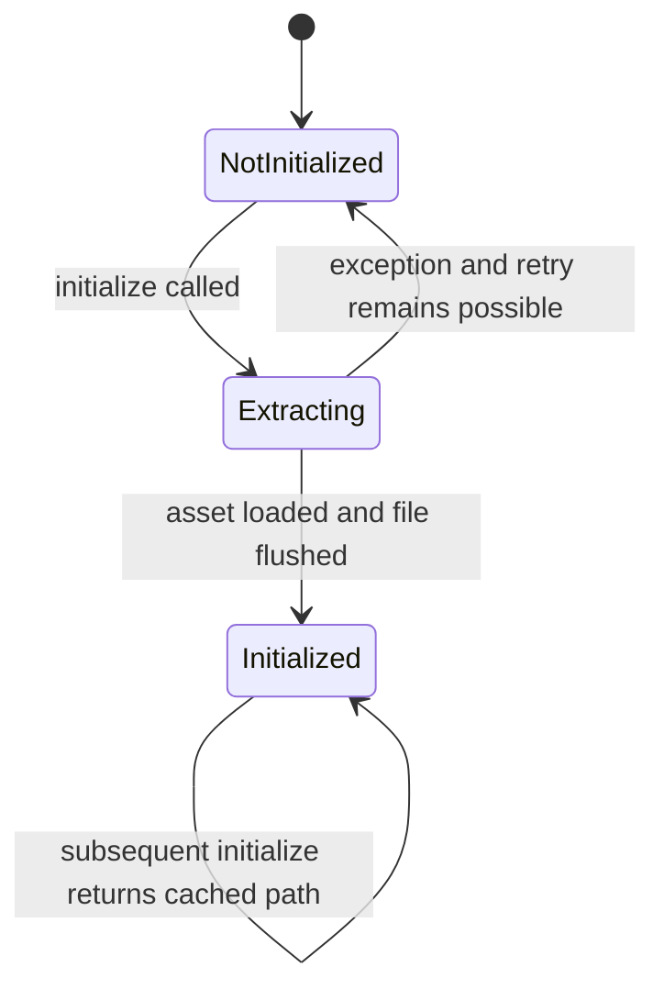
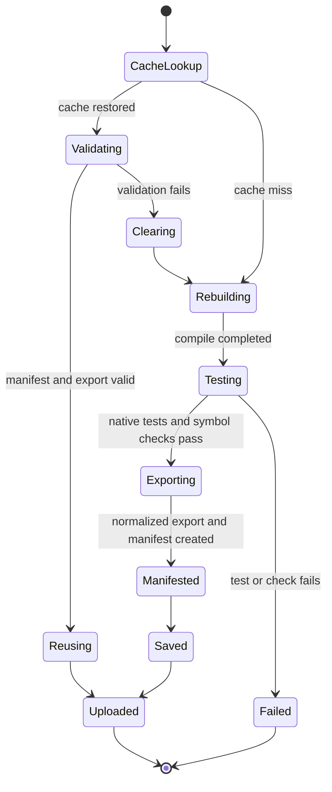
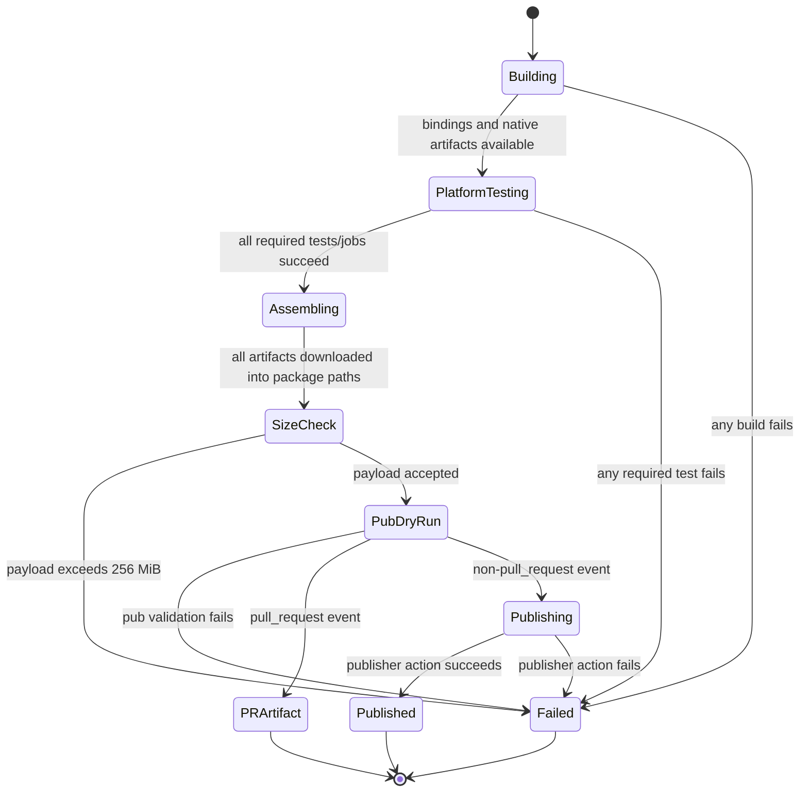
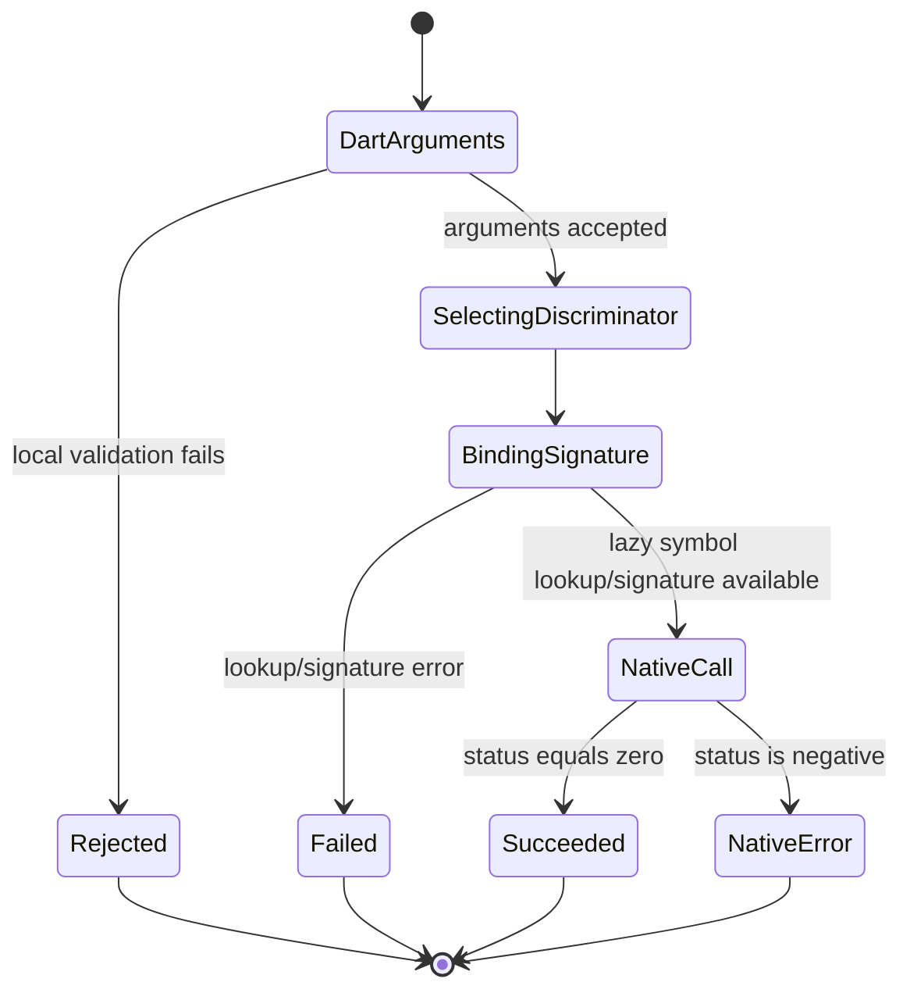

# State Machines

## 1. Runtime library resolution

🟢 All transitions are directly encoded in `lib/src/util.dart`. 🔴 No production `Initialized -> Shutdown` transition is defined locally.

## 2. Android certificate extraction

State variables are `_initialized` and `_certPath`. The external `certificate applied to libgit2` state is not represented in this helper, so successful extraction does not by itself prove HTTPS readiness.

## 3. Native artifact cache

🟢 This is reconstructed from current composite actions. A cache hit is not trusted merely because it exists; validation is a distinct state.

## 4. Release qualification

🟢 Publication is structurally downstream of every required platform job. 🟡 Whether branch protection separately enforces the workflow is outside repository evidence.

## 5. libgit2 global-option call

Only pack maximum object size currently has explicit local range rejection. Other validity rules remain native-side.

## State gaps

- 🔴 No persisted release state or deployment record exists in the repository.
- 🔴 No explicit libgit2 lifecycle state tracks reference count or shutdown ownership.
- 🔴 No state connects `AndroidSSLHelper` extraction to successful application of certificate locations.
- 🔴 Runtime native-loader state is implicit in lazy top-level initialization and exceptions rather than represented by an enum/object; option access can occur without reading the initializing `libgit2` global.
