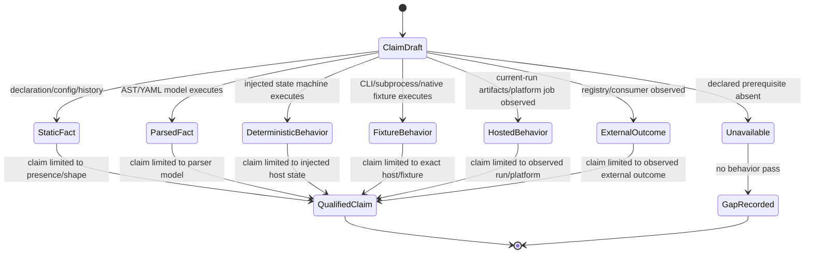
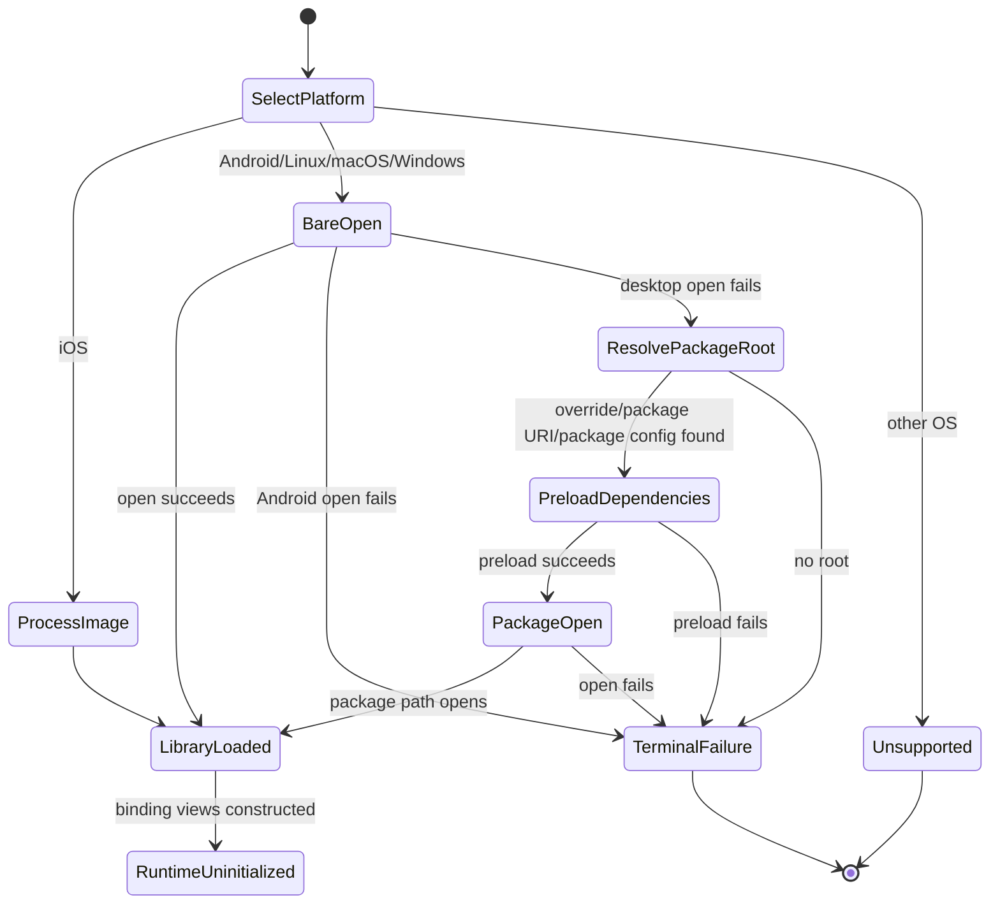
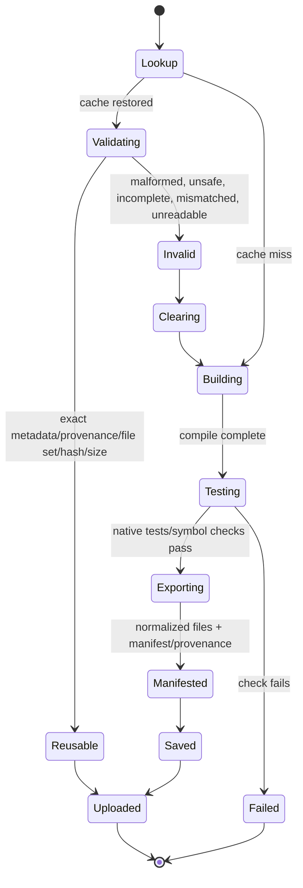
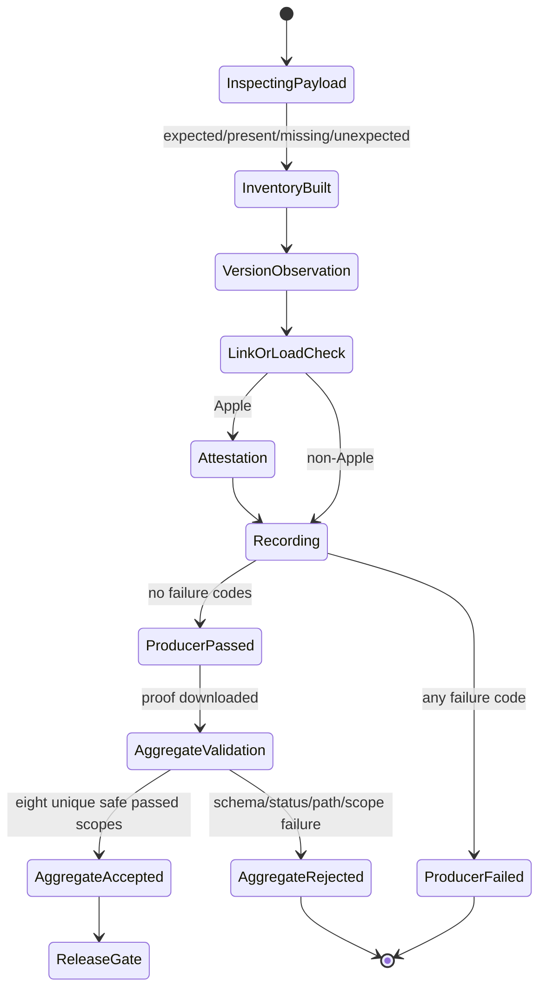
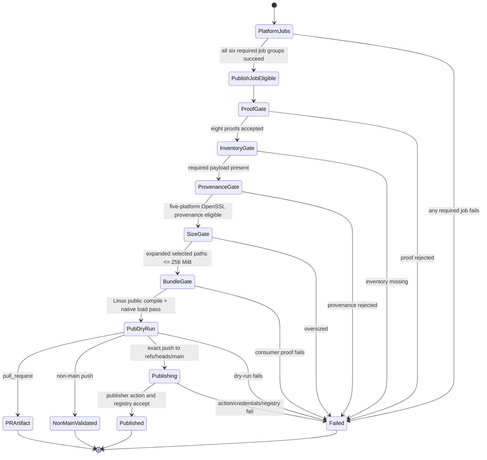

# State Machines

## Scope

These machines describe explicit runtime phases and reconstructed workflow/evidence states in the 2026-08-25 working tree. Only `Libgit2RuntimeState` and the Android TLS helper store direct in-process state. Cache, proof, bundle, and release states are ephemeral filesystem/workflow states; they are not persisted application records.

## 1. Evidence claim authority

🟢 BR-001–BR-008 and feature-005 W001–W006 require this qualification. A green enclosing test with an `unavailable` branch stays `GapRecorded`, not `QualifiedClaim` for the missing behavior.

## 2. Managed libgit2 runtime

```mermaid
stateDiagram-v2
  [*] --> Uninitialized
  Uninitialized --> Initializing: bindings/options/ensure/withCall/acquireOwner
  Initializing --> Initialized: native init returns > 0
  Initializing --> RollingBack: init throws or returns <= 0
  RollingBack --> Uninitialized: shutdown rollback >= 0; initialize exception
  RollingBack --> Faulted: rollback throws or returns < 0
  Initialized --> Initialized: ensureInitialized reuses lease
  Initialized --> ShutdownBlocked: activeCallCount > 0 or liveOwnerCount > 0
  ShutdownBlocked --> Initialized: caller drains pins
  Initialized --> ShuttingDown: shutdown with zero pins
  Uninitialized --> Terminated: shutdown; cached result 0; no native call
  ShuttingDown --> Terminated: native result >= 0
  ShuttingDown --> Faulted: native result < 0 or throws
  Terminated --> Terminated: repeated shutdown returns cached result
  Terminated --> ReentryRejected: initialize/access
  Faulted --> ReentryRejected: initialize/access/shutdown
```

🟢 Directly encoded by `_RuntimePhase`, `ensureInitialized()`, and `shutdown()`. 🟡 The state is isolate-local; libgit2's process-global count and external consumer drainage are not current-run observations.

## 3. Transient and persistent pins

```mermaid
stateDiagram-v2
  [*] --> Acquired
  Acquired --> DestructorBound: bindDestructor
  Acquired --> Completing: transfer or release without destructor
  DestructorBound --> Completing: release or rollbackConstruction
  DestructorBound --> Completing: finalizer fallback
  Completing --> Completed: transfer or destructor succeeds
  Completing --> Acquired: destructor throws; pin retained
  Completing --> ReentrantRejected: cleanup invoked while completing
  Completed --> Completed: repeated release/transfer is no-op
  Completed --> BindRejected: late/double destructor bind
  Completed --> [*]
```

`Acquired` increments `liveOwnerCount`; only `Completed` decrements it. Finalizer failure is reported as `finalizerCleanup` and does not throw across the finalizer boundary. 🟢 injected lifecycle tests; 🔴 production native-owner integration.

## 4. Native library resolution

🟢 Failure and platform-plan transitions are locally observed. 🔴 The successful probe does not report the actual handle origin; Android plan evidence is host-side mapping rather than device loader execution.

## 5. Android certificate extraction

```mermaid
stateDiagram-v2
  [*] --> NotInitialized
  NotInitialized --> ResolvingDirectory: initialize
  ResolvingDirectory --> LoadingAsset: directory succeeds
  LoadingAsset --> WritingCertificate: asset succeeds
  WritingCertificate --> Initialized: write completes; path then flag committed
  ResolvingDirectory --> NotInitialized: failure rethrown
  LoadingAsset --> NotInitialized: failure rethrown
  WritingCertificate --> NotInitialized: failure rethrown
  Initialized --> Initialized: later initialize returns cached path
  Initialized --> NotInitialized: test-only reset
```

🟢 Five deterministic tests observe sequential success/cache and all three retry edges. 🔴 There is no in-flight state or synchronization, file-validity recheck, default Android storage/asset proof, native option-applied state, or HTTPS-ready state.

## 6. Native cache artifact

🟢 Cache hit is an input to validation, never an acceptance state. 🔴 Symlink containment, approved-exception behavior, and a create-side empty-export error path remain incomplete evidence.

## 7. Platform release proof

🟢 Producer transitions are richer than aggregate acceptance. 🔴 Aggregate acceptance does not validate candidate/current run, inventory completeness, linkage/version/attestation contents, or proof hashes against downloaded release payload bytes.

## 8. Disposable consumer bundle

```mermaid
stateDiagram-v2
  [*] --> InputsDeclared
  InputsDeclared --> BundleRejected: origin label != same-run
  InputsDeclared --> BundleRejected: missing binding/payload or checkout binding
  InputsDeclared --> Assembling: inputs pass lexical/layout checks
  Assembling --> EvidenceWritten: source copied; binding/payload injected
  EvidenceWritten --> ResolvingConsumer: offline pub get
  ResolvingConsumer --> ConsumerRejected: package root != bundle
  ResolvingConsumer --> PublicCompile: compile-public-api
  ResolvingConsumer --> NativeLoad: load-native
  ResolvingConsumer --> Probe: ABI/loader/Android plan
  PublicCompile --> Passed: public imports execute
  NativeLoad --> Passed: runtime initializes
  Probe --> Passed: selected probe succeeds
  PublicCompile --> Failed: non-zero/timeout/internal import
  NativeLoad --> Failed: loader error/timeout
  Probe --> Unavailable: declared native prerequisite absent
  Passed --> [*]
  Failed --> [*]
  Unavailable --> [*]
  BundleRejected --> [*]
```

🟢 Package-config resolution to the disposable root is checked. 🟡 Local native passes used cached 1.12.1 Windows bytes. 🔴 `bundle-proof.json` existence and a caller label do not attest current-run identity; native handle origin is not observed.

## 9. Release qualification and publication

🟢 Parsed workflow facts establish graph order and exact-main condition. 🔴 No current feature-005 hosted run, publisher execution, or registry outcome was observed; `Published` remains unproven.

## Cross-machine gaps

- 🔴 No persisted record joins runtime phase, owner leases, TLS application, native artifact identity, and release revision.
- 🔴 No proof hash/candidate join binds `Platform release proof -> downloaded payload -> disposable bundle -> published package`.
- 🔴 No state transition represents external `git2dart` compatibility or owner shutdown.
- 🔴 No current device/host matrix establishes equivalent runtime strength across five platform families.
