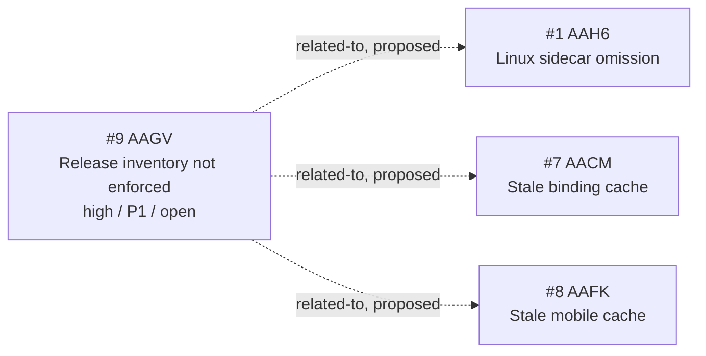

<!-- GENERATED, DO NOT EDIT: regenerated by /reversa-debugger-graph at 2026-08-17T00:25:00+07:00 from 1 bug -->

# Bug Graph: validation-release-assembly

The central release-gate defect is related to three upstream paths that can feed incomplete or stale outputs into assembly.

