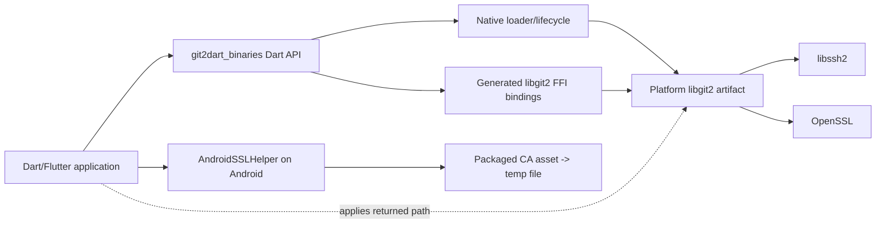
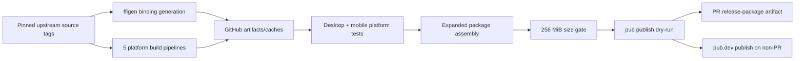

# Architecture Overview

## Scope

`git2dart_binaries` is a cross-platform Flutter FFI package and its release factory. It bridges Dart consumers to libgit2 and supplies the platform-native artifacts required at runtime.

This architecture is extracted only from `F:\git2dart_binaries` at commit `680d914c8e2b87682f0b68318aee855838eb58e8`.

Confidence: 🟢 **CONFIRMED** from local code/config/history; 🟡 **INFERRED** relationship; 🔴 **GAP** requiring external evidence.

## Architectural purpose

The system has two cooperating planes:

1. **Runtime plane** — public Dart exports, generated FFI declarations, dynamic/process loading, libgit2 initialization/global options, native errors, and Android certificate extraction.
2. **Supply plane** — GitHub Actions generates bindings, compiles upstream native dependencies, validates artifacts, tests platform packages, assembles the expanded pub package, and publishes it.

The tracked checkout is source and recipes. The actual release product is an expanded package assembled by CI with generated `bindings.dart` and native libraries.

## Context summary

| Actor/system | Relationship | Protocol/format | Confidence |
|---|---|---|---|
| Dart/Flutter application | Imports the package and calls Dart FFI API | Dart package API, native ABI | 🟢 |
| `git2dart` high-level package | Likely principal transitive consumer | Dart imports/dependency constraint | 🟡 |
| libgit2 | Implements Git operations | C ABI | 🟢 |
| libssh2 | Supplies SSH transport | native link/shared dependency | 🟢 |
| OpenSSL | Supplies TLS/crypto | native link/shared dependency | 🟢 |
| Flutter tooling | Bundles FFI plugins/assets | pub/Flutter plugin metadata | 🟢 |
| CocoaPods/CMake/Gradle | Integrate native artifacts into apps | platform build metadata | 🟢 |
| GitHub Actions | Builds, tests, and assembles artifacts | workflow jobs/artifacts/caches | 🟢 |
| pub.dev | Receives validated package publication | Dart publisher action/tokens | 🟢 workflow intent; 🔴 current result |
| Upstream Git repositories | Supply pinned libgit2/libssh2/OpenSSL source | Git tag checkout | 🟢 |

No REST/GraphQL API, webhook endpoint, database, message queue, or application server is produced.

## Container model

### Runtime containers

- **Dart package API:** public exports and handwritten helpers.
- **Generated FFI layer:** generated Dart structs/enums/functions for libgit2.
- **Native loader/lifecycle:** resolves and initializes the correct library.
- **Platform artifact set:** libgit2 and platform-dependent libssh2/OpenSSL artifacts.
- **Android certificate asset/cache:** packaged CA bundle copied to temporary app storage.

### Supply containers

- **Binding-generation action:** converts pinned headers into Dart ABI declarations.
- **Platform native-build actions:** build normalized artifacts for Android, iOS, Linux, macOS, Windows.
- **Artifact/cache fabric:** GitHub artifacts and manifest-validated caches.
- **Platform test jobs:** inject the generated outputs and exercise loader/options/package behavior.
- **Release assembler/publisher:** combines all outputs, applies gates, and publishes.

## Component responsibilities

| Component | Primary responsibility | Direct dependencies |
|---|---|---|
| Dart FFI facade | Stable package entry and helpers | generated bindings, loader, ffi |
| Native loader/lifecycle | Platform selection, dependency preload, package-root fallback, init | OS loader, package config, platform artifacts |
| Global-options wrapper | Typed dispatch to variadic `git_libgit2_opts` | generated enum/struct ABI, native libgit2 |
| Android TLS bootstrap | Extract CA asset after native initialization | Flutter asset bundle, temporary storage |
| Platform packaging | Map CI outputs to Flutter/CocoaPods/CMake/Gradle contracts | platform build systems |
| Native build/binding generation | Produce matching ABI and native libraries | upstream source tags/toolchains |
| Validation/release assembly | Establish publishable cross-platform evidence | every build/test artifact, pub.dev |

## Integration model

### Runtime path

### Supply path

## Data model

There is no persistent domain database. The meaningful data structures are build/runtime descriptors:

- a pinned native version set;
- generated binding artifact;
- platform artifact sets;
- cache manifests/fingerprints;
- expanded release payload;
- package-config entries for fallback resolution;
- process-local Android TLS state;
- borrowed libgit2 native error pointers.

See `erd-complete.md` for the conceptual relationships and `data-dictionary.md` for field-level details.

## Deployment and distribution

The project deploys a package rather than a service. GitHub-hosted runners produce platform artifacts; the final Linux job assembles and validates the pub package. Pull requests retain an inspection artifact, while configured branch pushes can publish to pub.dev using secrets.

No Docker, Kubernetes, Terraform, or application cloud runtime configuration exists. `deployment.md` documents the CI/distribution topology because GitHub Actions and pub.dev are the only configured cloud deployment surfaces.

## Technical debt and risk register

| Item | Evidence | Impact | Confidence |
|---|---|---|---|
| Generated binding/native artifacts absent from tracked checkout | referenced files missing locally | source-only tests cannot establish release behavior | 🟢 |
| Unchecked `git_libgit2_init()` result | `util.dart` | initialization failure may surface later | 🟢 |
| No production shutdown owner | shutdown only in tests | lifecycle/reference-count ambiguity | 🔴 boundary gap |
| Partial behavioral coverage of 33 global options | tests cover selected families | ABI/signature drift may escape | 🟢 |
| Android TLS extraction and application are separate | helper returns path only | extraction success can be mistaken for HTTPS readiness | 🟢 |
| Android first-call extraction is unsynchronized | static bool/path without lock | duplicate concurrent writes | 🟡 |
| Apple podspec version 1.11.2 vs pub 1.12.1 | current manifests | metadata/release coordination ambiguity | 🟢 |
| Platform plugin shims retain unused method-channel sample behavior | generated `getPlatformVersion` handlers | extra surface/confusion, low runtime impact | 🟢 |
| Windows missing-directory branch opens inside missing directory | `util.dart` | confusing failure path | 🟢 |
| No SBOM/signing/provenance verification documented | workflows | supply-chain assurance gap | 🔴 external/security gap |
| No formal cross-repository compatibility matrix | local docs/manifests | consumer upgrade coordination risk | 🔴 |

## Architectural invariants

1. Bindings and native artifacts use one pinned libgit2 version.
2. Platform artifact names must match loader and package-manager declarations.
3. macOS `install_name`, exported filename, podspec, and loader target must agree.
4. Android certificate configuration occurs after native initialization.
5. Pull requests cannot execute the publication step.
6. Publication remains downstream of all required platform tests/builds, size gate, and pub dry-run.
7. Cross-repository behavior is not upgraded from inferred to confirmed without direct consumer evidence.

